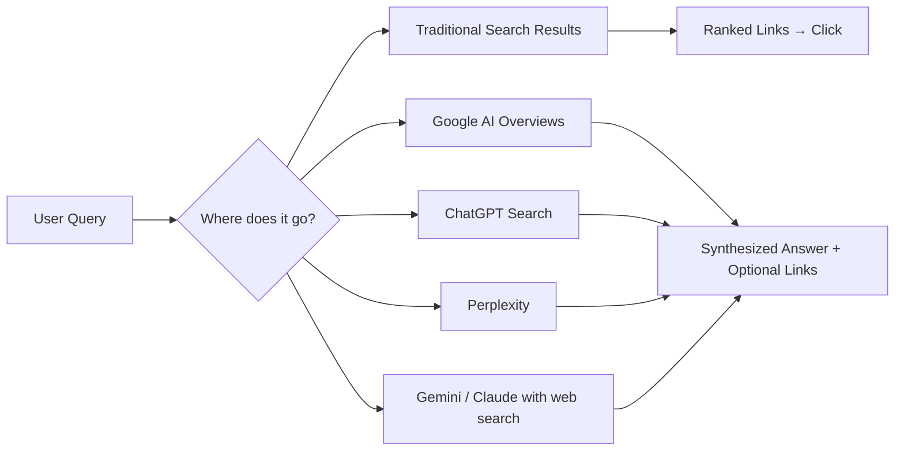

# Chapter 1: Introduction to Answer Engine Optimization

**Version:** 1.0

---

# Table of Contents

1. What is Answer Engine Optimization?
2. Why AEO Emerged
3. AEO vs. Traditional SEO
4. The New Search Landscape
5. Who Are the Answer Engines?
6. How Content Reaches an AI Answer
7. The AEO Opportunity and Risk
8. AEO and the Rest of This Book
9. Best Practices
10. Common Mistakes
11. Getting Started Checklist
12. Summary
13. References

---

# 1. What is Answer Engine Optimization?

Answer Engine Optimization (AEO) is the practice of structuring content so that AI-powered answer systems — ChatGPT, Google AI Overviews, Perplexity, Gemini, and Claude — can reliably retrieve, understand, and cite it when generating a direct answer to a user's question.

Where traditional SEO ([SEO Book](../seo/README.md)) optimizes for a ranked list of blue links, AEO optimizes for a single synthesized answer that may quote, paraphrase, or link to a source — or may not credit it at all. The unit of success shifts from "position 1" to "was my content the one the model pulled from and, ideally, cited."

---

# 2. Why AEO Emerged

Three shifts drove the rise of AEO as a discipline:

1. **Zero-click growth** — an increasing share of searches end without a click, as search engines and AI assistants answer directly on the results page or in a chat interface.
2. **Conversational, multi-turn search** — users increasingly ask full questions and follow-up questions rather than typing keyword fragments, changing how intent must be matched.
3. **LLM-mediated retrieval** — answer engines use retrieval-augmented generation (RAG) or live web search to ground responses in real content, meaning there is now a distinct, addressable step where content is selected as a source ([Chapter 2](chapter-02.md)).

---

# 3. AEO vs. Traditional SEO

| Dimension | Traditional SEO | AEO |
|---|---|---|
| Success unit | Ranking position, click-through | Citation, extraction, direct answer inclusion |
| Output surface | List of ranked links | Synthesized prose answer, sometimes with citations |
| Content shape that wins | Comprehensive, keyword-relevant pages | Extractable, self-contained, unambiguous passages |
| Measurement | Rank tracking, GSC, GA4 | AI visibility tracking, citation monitoring, brand mention tracking |
| Primary technical lever | Crawling, indexing, PageRank-style authority | Passage clarity, structured data, crawler accessibility, entity grounding |

AEO does not replace SEO — it is built on top of it. A page that cannot be crawled, indexed, or trusted under traditional SEO principles ([SEO Book, Chapters 3-6](../seo/chapter-03.md)) has no chance of being cited by an AI answer engine either.

---

# 4. The New Search Landscape

A single user question can now be answered through any of these surfaces, each with its own retrieval mechanism, citation behavior, and content preferences — covered individually in [Chapters 3-6](chapter-03.md).

---

# 5. Who Are the Answer Engines?

| Engine | Retrieval Mechanism | Citation Behavior |
|---|---|---|
| Google AI Overviews | Google's own index + generative synthesis | Shows source links alongside the answer |
| ChatGPT (with search) | Live web search plugin/tool calls | Inline citations with linked sources |
| Perplexity | Live web search, citation-first product design | Numbered citations are a core UX feature |
| Gemini | Google index + Google's models | Source links shown, varies by surface |
| Claude (with web search) | Live web search tool | Inline citations with linked sources |

Each is covered in depth in its own chapter later in this book.

---

# 6. How Content Reaches an AI Answer

At a high level, every answer engine performs some version of the same pipeline: retrieve candidate sources, extract relevant passages, rank/select the best evidence, and generate a response grounded in that evidence — optionally citing it. Understanding this pipeline, covered fully in [Chapter 2](chapter-02.md), is the foundation for every optimization tactic in this book.

---

# 7. The AEO Opportunity and Risk

**Opportunity:** being cited in an AI answer places a brand directly in front of a user at the exact moment of intent, often with less competition than a crowded SERP, and increasingly drives measurable referral traffic.

**Risk:** zero-click answers can also fully satisfy a user's query without any click at all — meaning some traditionally high-traffic pages may see impressions convert to AI citations instead of visits. AEO is as much about brand visibility and citation frequency as it is about traffic.

---

# 8. AEO and the Rest of This Book

This book proceeds from mechanism to platform to tactic to measurement:

- **[Chapter 2](chapter-02.md)** — the shared retrieval/ranking/citation mechanics behind all answer engines
- **[Chapters 3-6](chapter-03.md)** — platform-specific optimization for ChatGPT, Google AI Overviews, Perplexity, Gemini, and Claude
- **[Chapter 7](chapter-07.md)** — AI citations and passage-level citability
- **[Chapter 8](chapter-08.md)** — llms.txt and AI crawler accessibility
- **[Chapter 9](chapter-09.md)** — prompt engineering as an AEO discipline
- **[Chapter 10](chapter-10.md)** — measuring AI search visibility

---

# 9. Best Practices

- Treat AEO as additive to SEO fundamentals, not a replacement for them
- Optimize for extractable, self-contained passages, not just page-level relevance
- Track citation and brand-mention metrics separately from traditional rank tracking
- Monitor multiple answer engines — winning on one does not guarantee visibility on another

---

# 10. Common Mistakes

- Treating AEO as a checklist of tricks rather than a structural content discipline
- Ignoring AI crawler accessibility (robots rules blocking AI user agents)
- Assuming a page that ranks well in Google will automatically be cited by an AI answer engine
- Measuring only traffic and missing the citation/visibility half of the picture

---

# Getting Started Checklist

- [ ] Confirm the site's technical SEO foundation is solid (crawlable, indexable, fast)
- [ ] Identify which answer engines matter most for the target audience
- [ ] Audit whether AI crawlers can currently access the site
- [ ] Establish a baseline AI visibility measurement process before optimizing

---

# Summary

Answer Engine Optimization is the discipline of making content retrievable, extractable, and citable by AI-powered answer systems. It builds directly on traditional SEO fundamentals but shifts the unit of success from ranking position to citation and answer inclusion. The rest of this book covers the shared mechanics behind answer engines, platform-specific tactics, citation optimization, crawler accessibility, prompt-aware content design, and measurement.

---

# Learning Outcomes

After completing this chapter, you will understand:

- What AEO is and why it emerged
- How AEO relates to and depends on traditional SEO
- The landscape of major answer engines
- The high-level pipeline content must pass through to be cited

---

# References

- Google Search Central: [AI Features and Your Website](https://developers.google.com/search/docs/appearance/ai-features)
- OpenAI: [ChatGPT Search](https://help.openai.com/en/articles/9237897-chatgpt-search)
- Perplexity: [Perplexity Crawlers](https://docs.perplexity.ai/docs/resources/perplexity-crawlers)

---

**Next:** Chapter 2 – How AI Search Engines Work
