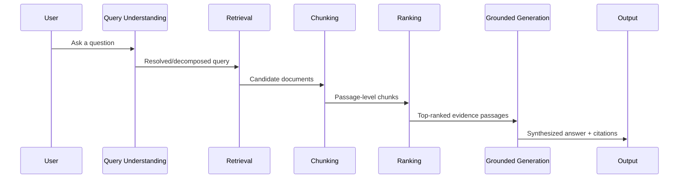

# Chapter 2: How AI Search Engines Work

**Version:** 1.0

---

# Table of Contents

1. Introduction
2. Two Retrieval Models: RAG vs. Live Web Search
3. The Retrieval-Augmented Generation Pipeline
4. Query Understanding and Decomposition
5. Retrieval: Finding Candidate Sources
6. Passage Extraction and Chunking
7. Ranking and Evidence Selection
8. Grounded Generation
9. Citation Attachment
10. Why This Pipeline Matters for Content Strategy
11. Diagram: The Full RAG Pipeline
12. Best Practices
13. Common Mistakes
14. Checklist
15. Summary
16. References

---

# 1. Introduction

Every answer engine — regardless of vendor — shares a common architecture for turning a user's question into a grounded, cited answer. Understanding this pipeline is what separates guesswork AEO tactics from a systematic content strategy. This chapter breaks the pipeline into its component stages and explains what each stage means for how content should be written and structured.

---

# 2. Two Retrieval Models: RAG vs. Live Web Search

| Model | How it Works | Examples |
|---|---|---|
| Retrieval-Augmented Generation (RAG) over a fixed index | The system retrieves from its own pre-built index/vector store, not the live web | Google AI Overviews (Google's index), Gemini |
| Live web search tool-calling | The model calls a search tool at query time, fetching current live results | ChatGPT Search, Perplexity, Claude with web search |

Both models converge on the same downstream steps once candidate documents are retrieved: extraction, ranking, and grounded generation.

---

# 3. The Retrieval-Augmented Generation Pipeline

RAG grounds a language model's output in retrieved documents rather than relying solely on parametric (trained-in) knowledge, which reduces hallucination and allows the system to cite real, current sources. The pipeline generalizes across nearly every answer engine:

1. Query understanding
2. Retrieval
3. Passage extraction/chunking
4. Ranking and evidence selection
5. Grounded generation
6. Citation attachment

---

# 4. Query Understanding and Decomposition

Before retrieving anything, the system interprets the user's question — resolving ambiguity, expanding implicit context (e.g., a follow-up question referring to "it"), and sometimes decomposing a complex question into multiple sub-queries that are retrieved independently and synthesized together.

---

# 5. Retrieval: Finding Candidate Sources

Retrieval identifies a candidate set of documents likely to contain the answer, using a combination of:

- **Lexical/keyword matching** (traditional search index signals)
- **Semantic/vector similarity** (embedding-based retrieval — see the [GEO Book, Chapter 5](../geo/chapter-05.md))
- **Authority and trust signals** (domain reputation, E-E-A-T-style signals — see [SEO Book, Chapter 12](../seo/chapter-12.md))

The retrieved set is typically much larger than what ultimately appears in the answer — this is a recall-oriented step, filtered down in later stages.

---

# 6. Passage Extraction and Chunking

Full pages are rarely fed to the model whole. Instead, systems split documents into passages/chunks — often a few hundred tokens each — and index or evaluate those chunks independently. This is the single most important mechanical fact behind AEO content strategy ([Chapter 7](chapter-07.md)): **a passage must stand on its own**, because it may be evaluated and cited in isolation from the rest of the page.

---

# 7. Ranking and Evidence Selection

From the retrieved and chunked candidates, the system selects the smallest set of high-confidence passages that answer the query, typically favoring:

- Passages that directly and unambiguously answer the question
- Passages with clear factual claims (numbers, steps, definitions) over vague prose
- Passages from sources with independent trust signals

---

# 8. Grounded Generation

The language model generates the final answer conditioned on the selected passages, synthesizing across multiple sources rather than quoting a single one verbatim in most cases. This is why AEO is not the same as "getting quoted" — the model may paraphrase, combine, or reword content from several sources into a single answer.

---

# 9. Citation Attachment

Some systems (Perplexity, ChatGPT Search, Claude) attach explicit numbered or inline citations linking back to source passages. Others (Google AI Overviews) show a set of linked source cards alongside the generated answer without inline attribution to specific sentences. Citation behavior is platform-specific and covered per-platform in [Chapters 3-6](chapter-03.md).

---

# 10. Why This Pipeline Matters for Content Strategy

| Pipeline Stage | Content Implication |
|---|---|
| Retrieval | Must be crawlable/indexable/accessible to the retrieving system ([Chapter 8](chapter-08.md)) |
| Chunking | Each passage/section must be self-contained and unambiguous |
| Ranking | Passages should state facts directly and avoid requiring external context |
| Grounded generation | Structuring content as clear Q&A or step-based sections increases extraction fit |
| Citation | Clear authorship, dates, and structured data increase trust and citation odds |

---

# 11. Diagram: The Full RAG Pipeline

---

# 12. Best Practices

- Write in self-contained passages/sections that don't depend on surrounding context to make sense
- Lead with the direct answer, then elaborate — mirrors how ranking stages favor unambiguous evidence
- Keep factual claims explicit and structured (numbers, dates, steps) rather than buried in narrative prose
- Ensure the site is technically accessible to both traditional and AI-specific crawlers

---

# 13. Common Mistakes

- Writing long, meandering passages where the actual answer is buried mid-paragraph
- Assuming full-page relevance guarantees passage-level extraction
- Ignoring that content may be chunked and evaluated completely out of its original page context
- Blocking AI crawler user agents unintentionally via `robots.txt`

---

# 14. Checklist

- [ ] Site is fully crawlable and indexable under standard technical SEO
- [ ] Key facts are stated directly, not implied
- [ ] Each section/passage can be understood without reading the full page
- [ ] AI crawler access has been explicitly verified, not assumed

---

# Summary

Answer engines share a common retrieval-augmented pipeline: understand the query, retrieve candidate documents, chunk them into passages, rank the best evidence, generate a grounded answer, and (often) attach citations. Because content is frequently evaluated and cited at the passage level rather than the page level, the single highest-leverage AEO practice is writing self-contained, directly-stated passages.

---

# Learning Outcomes

After completing this chapter, you will understand:

- The difference between fixed-index RAG and live web search retrieval
- The six-stage pipeline shared by nearly all answer engines
- Why passage-level chunking is the central mechanical fact behind AEO
- How each pipeline stage maps to a concrete content practice

---

# References

- Lewis et al., "Retrieval-Augmented Generation for Knowledge-Intensive NLP Tasks"
- Google Search Central: How AI Overviews Work
- OpenAI: Search Tool Documentation

---

**Next:** Chapter 3 – Optimizing for ChatGPT Search
