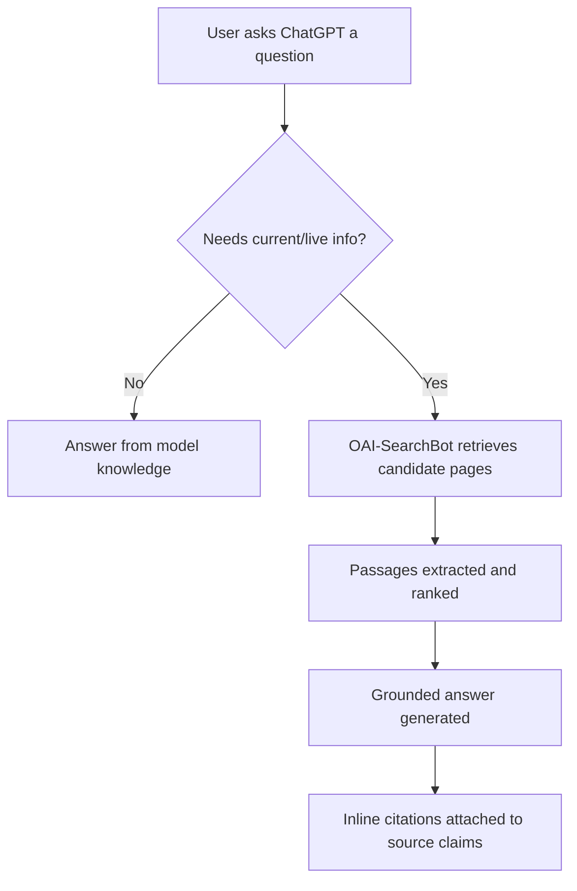

# Chapter 3: Optimizing for ChatGPT Search

**Version:** 1.0

---

# Table of Contents

1. Introduction
2. How ChatGPT Search Retrieves Content
3. OAI-SearchBot and Crawler Access
4. Citation Style and Behavior
5. Conversational Query Patterns
6. Multi-Turn Context and Follow-Up Questions
7. Content Formats That Perform Well
8. ChatGPT Shopping and Product Results
9. Custom GPTs and Actions
10. Diagram: ChatGPT Search Flow
11. Best Practices
12. Common Mistakes
13. Checklist
14. Summary
15. References

---

# 1. Introduction

ChatGPT Search integrates live web search directly into conversational responses, letting ChatGPT answer time-sensitive or fact-specific questions with cited, up-to-date sources rather than relying solely on its training data. For publishers and brands, this makes ChatGPT one of the highest-volume answer engines to optimize for, given ChatGPT's user base size.

---

# 2. How ChatGPT Search Retrieves Content

ChatGPT Search combines a search index (via Bing and OpenAI's own crawling infrastructure) with the general retrieval-augmented pipeline described in [Chapter 2](chapter-02.md): the model decides when a query needs live information, issues a search, retrieves and reads candidate pages, and synthesizes an answer with inline citations.

---

# 3. OAI-SearchBot and Crawler Access

OpenAI operates distinct crawlers for different purposes:

| Crawler | Purpose | robots.txt User-Agent |
|---|---|---|
| `OAI-SearchBot` | Powers ChatGPT Search retrieval | `OAI-SearchBot` |
| `GPTBot` | Used for model training data collection | `GPTBot` |
| `ChatGPT-User` | Fetches a page live during a user's active conversation | `ChatGPT-User` |

Blocking `GPTBot` (to opt out of training data use) does **not** block `OAI-SearchBot` — these are separate directives with separate purposes. A site that wants to be citable in ChatGPT Search but not used for training must allow `OAI-SearchBot` and `ChatGPT-User` while disallowing `GPTBot`:

```
User-agent: GPTBot
Disallow: /

User-agent: OAI-SearchBot
Allow: /

User-agent: ChatGPT-User
Allow: /
```

---

# 4. Citation Style and Behavior

ChatGPT Search attaches inline citations (small linked source markers) directly within the generated answer text, typically citing the specific source a claim was drawn from rather than a single undifferentiated list at the end. This makes passage-level clarity ([Chapter 2, Section 6](chapter-02.md)) directly visible in citation placement — a well-isolated factual passage is more likely to earn its own citation marker.

---

# 5. Conversational Query Patterns

ChatGPT users frequently phrase queries as full natural-language questions rather than keyword fragments: "What's the best way to fix layout shift on a WordPress site?" rather than "fix layout shift wordpress." Content written to directly answer full questions — not just to rank for a keyword phrase — aligns better with how these queries are matched.

---

# 6. Multi-Turn Context and Follow-Up Questions

Unlike a single traditional search query, ChatGPT conversations carry context across turns. A follow-up question ("what about on mobile?") is interpreted in light of the prior turn. Content that anticipates natural follow-up questions — and structures FAQ-style sections around them — increases the odds of being retrieved across an entire conversational thread, not just the opening query.

---

# 7. Content Formats That Perform Well

- **Direct-answer openings** — leading paragraphs that state the answer before elaborating
- **FAQ sections** with explicit question headers matching natural phrasing
- **Numbered/step-based instructions** for "how to" queries
- **Comparison tables** for "X vs. Y" and "best X for Y" queries
- **Explicit dates and version numbers** for time-sensitive topics (pricing, specs, current events)

---

# 8. ChatGPT Shopping and Product Results

ChatGPT increasingly surfaces product results with images, pricing, and links for shopping-related queries, drawing on structured product data (`Product` schema — [SEO Book, Chapter 14](../seo/chapter-14.md)) and merchant feeds. E-commerce sites should ensure product schema, pricing, and availability data are accurate and current.

---

# 9. Custom GPTs and Actions

Beyond organic citation in ChatGPT Search, brands can build Custom GPTs or expose Actions (API integrations) that let ChatGPT interact directly with a product or service inside a conversation — a distinct, more direct channel than earning a citation, relevant for SaaS and API-driven businesses.

---

# 10. Diagram: ChatGPT Search Flow



---

# 11. Best Practices

- Explicitly allow `OAI-SearchBot` and `ChatGPT-User` in `robots.txt` if citation visibility is a goal
- Write direct-answer openings for every important page
- Structure FAQ content around natural follow-up questions, not just primary keywords
- Keep time-sensitive facts (pricing, dates, specs) current — stale facts reduce citation trust
- Implement `Product` and `Organization` schema for shopping-relevant content

---

# 12. Common Mistakes

- Blocking `OAI-SearchBot` while trying to block `GPTBot`, unintentionally losing citation eligibility
- Writing keyword-fragment-style content that doesn't match conversational question phrasing
- Leaving pricing, availability, or dated facts stale
- Ignoring follow-up-question patterns when structuring FAQ content

---

# 13. Checklist

- [ ] `robots.txt` explicitly allows `OAI-SearchBot` and `ChatGPT-User`
- [ ] Training-data opt-out (`GPTBot` disallow) set deliberately, independent of search visibility
- [ ] Key pages open with a direct, extractable answer
- [ ] FAQ sections structured around natural conversational follow-ups
- [ ] Product/pricing data current and marked up with schema

---

# Summary

ChatGPT Search retrieves and cites live web content through `OAI-SearchBot`, distinct from the `GPTBot` training crawler. Optimizing for it means ensuring crawler access, writing direct-answer content that matches conversational question phrasing, structuring FAQs around natural follow-ups, and keeping time-sensitive facts current.

---

# Learning Outcomes

After completing this chapter, you will understand:

- The distinct roles of OpenAI's crawlers and how to configure access to each
- How ChatGPT Search's citation behavior differs from other answer engines
- How conversational, multi-turn queries change content strategy
- Which content formats are best suited to ChatGPT Search retrieval

---

# References

- OpenAI: Search Documentation
- OpenAI: GPTBot and Crawler Documentation

---

**Next:** Chapter 4 – Optimizing for Google AI Overviews
