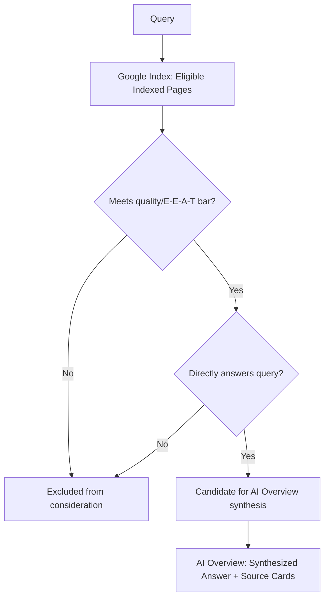

# Chapter 4: Optimizing for Google AI Overviews

**Version:** 1.0

---

# Table of Contents

1. Introduction
2. What Are AI Overviews?
3. How AI Overviews Select Sources
4. AI Overviews vs. Featured Snippets
5. The Relationship Between Ranking and AI Overview Inclusion
6. Content Structures That Get Included
7. AI Mode
8. Measuring AI Overview Impact
9. Diagram: AI Overview Source Selection
10. Best Practices
11. Common Mistakes
12. Checklist
13. Summary
14. References

---

# 1. Introduction

Google AI Overviews (formerly Search Generative Experience / SGE) place an AI-generated summary directly at the top of Google's search results for many queries, drawing on Google's index and citing a set of source links. Because AI Overviews sit above traditional organic results, inclusion can meaningfully affect click-through even for pages that also rank well organically.

---

# 2. What Are AI Overviews?

AI Overviews synthesize an answer from multiple retrieved web pages, displaying it in a distinct module above traditional blue-link results, accompanied by a set of linked source cards. They appear primarily for informational and exploratory queries, and less often for highly transactional or navigational searches.

---

# 3. How AI Overviews Select Sources

AI Overviews draw from Google's existing web index — meaning a page must already satisfy standard indexability and quality requirements ([SEO Book, Chapters 3-6](../seo/chapter-03.md)) before it can be considered at all. From the eligible pool, selection favors:

- Pages that directly and clearly answer the query
- Pages with strong topical relevance and depth ([SEO Book, Chapter 9](../seo/chapter-09.md))
- Pages with strong E-E-A-T signals ([SEO Book, Chapter 12](../seo/chapter-12.md))
- Pages with structured data reinforcing factual claims ([SEO Book, Chapter 14](../seo/chapter-14.md))

---

# 4. AI Overviews vs. Featured Snippets

| Aspect | Featured Snippets | AI Overviews |
|---|---|---|
| Source count | Single source | Multiple synthesized sources |
| Content | Extracted verbatim passage | Generated/synthesized summary |
| Position | Above organic results | Above organic results, larger module |
| Optimization lever | Passage matching a single query pattern | Broad topical coverage across multiple sources |

A page that has historically won featured snippets is a reasonable AI Overview candidate, but AI Overviews synthesize across several sources, so ranking as *the single best* source matters less than being *a strong contributing* source.

---

# 5. The Relationship Between Ranking and AI Overview Inclusion

Strong organic ranking correlates with AI Overview inclusion but does not guarantee it, since inclusion also depends on how clearly a page's content maps to the specific synthesized answer Google generates. Conversely, appearing in an AI Overview does not replace the value of ranking organically — many users still scroll past the AI Overview to traditional results, especially for queries requiring deeper comparison.

---

# 6. Content Structures That Get Included

- Clear, direct-answer paragraphs near the top of relevant sections
- Well-labeled headings that match common question phrasings
- Definition-style content ("X is...") for conceptual queries
- Step-by-step instructions for "how to" queries
- Structured data (`FAQPage`, `HowTo`, `Article`) reinforcing the same facts stated in visible text

---

# 7. AI Mode

Google's AI Mode extends the AI Overview concept into a fully conversational, multi-turn search experience within Search itself, functioning closer to a chat interface than a traditional results page. The same source-selection principles apply, with an added emphasis on maintaining answer quality across follow-up questions within a session — mirroring the multi-turn considerations covered for ChatGPT in [Chapter 3](chapter-03.md).

---

# 8. Measuring AI Overview Impact

Search Console's Performance report can be filtered by search appearance type in some views to help identify queries where AI Overviews are present, though direct citation-level reporting is limited compared to platforms like Perplexity. Combine Search Console data with manual query sampling to build a fuller picture — covered in [Chapter 10](chapter-10.md).

---

# 9. Diagram: AI Overview Source Selection

---

# 10. Best Practices

- Maintain strong technical SEO and E-E-A-T fundamentals as the prerequisite for any AI Overview visibility
- Structure content with direct-answer openings and clear headings matching real user questions
- Reinforce visible facts with matching structured data
- Monitor Search Console and manual query sampling together, since AI Overview reporting is less granular than traditional rankings

---

# 11. Common Mistakes

- Assuming AI Overview inclusion is achievable without first meeting baseline indexability and quality standards
- Optimizing for a single query phrase instead of the broader topic an AI Overview is likely to synthesize
- Letting structured data drift out of sync with visible page content
- Ignoring AI Mode as "just an experiment" rather than tracking its growing query share

---

# 12. Checklist

- [ ] Page meets baseline technical SEO and indexability requirements
- [ ] Content opens with a direct, clear answer to the target question
- [ ] Headings match natural question phrasing
- [ ] Structured data reinforces the same facts stated in visible text
- [ ] AI Overview / AI Mode visibility tracked via Search Console and manual sampling

---

# Summary

Google AI Overviews synthesize answers from multiple sources drawn from Google's existing index, meaning strong traditional SEO fundamentals are a prerequisite, not a substitute, for AI Overview visibility. Direct-answer content structures, clear headings, and consistent structured data improve the odds of being selected as a contributing source, both in AI Overviews and the more conversational AI Mode.

---

# Learning Outcomes

After completing this chapter, you will understand:

- How AI Overviews differ from both traditional results and featured snippets
- What determines whether a page is selected as a source
- How AI Mode extends AI Overviews into conversational search
- How to approach measuring AI Overview impact given limited native reporting

---

# References

- Google Search Central: AI Overviews Documentation
- Google Search Central: AI Mode Documentation

---

**Next:** Chapter 5 – Optimizing for Perplexity
