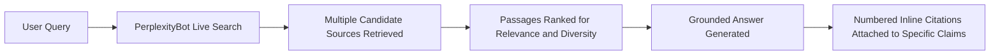

# Chapter 5: Optimizing for Perplexity

**Version:** 1.0

---

# Table of Contents

1. Introduction
2. Perplexity's Citation-First Design
3. PerplexityBot and Crawler Access
4. How Perplexity Ranks and Selects Sources
5. Perplexity Pro Search and Deep Research Modes
6. Content Formats That Perform Well on Perplexity
7. Perplexity Shopping and Publisher Program
8. Diagram: Perplexity Answer Construction
9. Best Practices
10. Common Mistakes
11. Checklist
12. Summary
13. References

---

# 1. Introduction

Perplexity positions itself as an "answer engine" first, built around live web search with citations as a core, always-visible part of its UX rather than an afterthought. For AEO purposes, Perplexity is one of the clearest platforms to study because its citation behavior is explicit, numbered, and directly attributable to source passages.

---

# 2. Perplexity's Citation-First Design

Every Perplexity answer displays numbered citation markers inline within the generated text, each linking to a specific source. Users can inspect exactly which source backed which claim — making Perplexity a useful proving ground for understanding which content structures actually earn citations, since the attribution is transparent rather than aggregated.

---

# 3. PerplexityBot and Crawler Access

Perplexity operates its own crawler, `PerplexityBot`, which must be explicitly allowed in `robots.txt` for a site to be eligible as a live citation source:

```
User-agent: PerplexityBot
Allow: /
```

Sites blocking `PerplexityBot` are excluded from live retrieval, though Perplexity may still reference content indexed through other means depending on its data partnerships. Explicit allowance is the reliable path to eligibility.

---

# 4. How Perplexity Ranks and Selects Sources

Perplexity's retrieval follows the general RAG pattern from [Chapter 2](chapter-02.md): live web search, passage extraction, ranking, and grounded generation. It shows a distinct preference for:

- Recent, current content for time-sensitive queries
- Sources with clear, quotable factual statements
- A diverse set of sources rather than repeatedly citing a single domain for one answer

---

# 5. Perplexity Pro Search and Deep Research Modes

Perplexity's Pro Search and Deep Research modes issue multiple underlying searches and synthesize across a larger set of sources than a standard query, often producing longer, more heavily cited reports. Content that performs well in these modes tends to be comprehensive, well-organized with clear subheadings, and rich in verifiable facts — similar in shape to a strong pillar page ([SEO Book, Chapter 17](../seo/chapter-17.md)).

---

# 6. Content Formats That Perform Well on Perplexity

- Direct, quotable factual statements ("X is defined as...", "The recommended value is...")
- Clearly labeled sections with descriptive subheadings
- Data-backed claims with specific numbers, dates, and sources of their own
- Comparison tables for "X vs. Y" style questions

---

# 7. Perplexity Shopping and Publisher Program

Perplexity has introduced shopping-related features surfacing product results and has run publisher partnership programs providing revenue-sharing or attribution arrangements for cited content. Brands with e-commerce or publishing content should monitor these programs directly, as terms and eligibility change over time.

---

# 8. Diagram: Perplexity Answer Construction



---

# 9. Best Practices

- Explicitly allow `PerplexityBot` in `robots.txt`
- Write direct, quotable factual statements rather than vague or hedged claims
- Structure long-form content with clear, descriptive subheadings for Deep Research-style retrieval
- Keep time-sensitive content current, since Perplexity favors recency for such queries

---

# 10. Common Mistakes

- Forgetting to explicitly allow `PerplexityBot`, assuming default crawler access covers it
- Writing hedged, ambiguous statements that are hard to cite as a discrete fact
- Neglecting subheading structure on long-form content used in Deep Research-style queries
- Ignoring Perplexity in AI visibility tracking because it has a smaller user base than ChatGPT

---

# 11. Checklist

- [ ] `robots.txt` explicitly allows `PerplexityBot`
- [ ] Key facts are stated as direct, quotable claims
- [ ] Long-form content uses clear, descriptive subheadings
- [ ] Time-sensitive content is kept current
- [ ] Perplexity citation frequency tracked alongside other answer engines

---

# Summary

Perplexity's citation-first design makes it a clear window into what earns AI citations: explicit `PerplexityBot` crawler access, direct and quotable factual statements, well-subheaded long-form structure, and current information for time-sensitive topics. Its transparent, numbered citation model makes it a useful platform for validating broader AEO tactics.

---

# Learning Outcomes

After completing this chapter, you will understand:

- Why Perplexity's citation transparency makes it a useful AEO benchmark
- How to configure crawler access for PerplexityBot
- What content formats perform well in standard and Deep Research modes
- How Perplexity's publisher and shopping programs relate to AEO strategy

---

# References

- Perplexity: How Perplexity Works
- Perplexity: PerplexityBot Documentation

---

**Next:** Chapter 6 – Optimizing for Gemini & Claude
