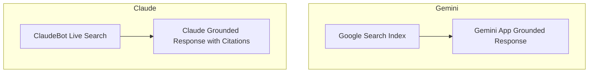

# Chapter 6: Optimizing for Gemini & Claude

**Version:** 1.0

---

# Table of Contents

1. Introduction
2. Gemini: Google's Ecosystem Advantage
3. Gemini in Search, the Gemini App, and Workspace
4. Googlebot, Google-Extended, and Gemini's Data Sources
5. Claude: Anthropic's Web Search Tool
6. ClaudeBot and Crawler Access
7. Claude's Citation Behavior
8. Claude in Agentic and Developer Contexts
9. Comparing Gemini and Claude for AEO
10. Diagram: Two Different Retrieval Paths
11. Best Practices
12. Common Mistakes
13. Checklist
14. Summary
15. References

---

# 1. Introduction

Gemini and Claude represent two different architectural relationships to the live web. Gemini benefits from deep integration with Google's own Search index and infrastructure, while Claude, when web search is enabled, uses a dedicated live search tool with its own crawler. This chapter covers both, since each requires distinct crawler-access and content decisions.

---

# 2. Gemini: Google's Ecosystem Advantage

Gemini is deeply integrated with Google's broader ecosystem — Search, Workspace, Android — meaning content already well-optimized for Google Search and AI Overviews ([Chapter 4](chapter-04.md)) has a strong head start for Gemini visibility as well, since much of Gemini's grounding draws on the same underlying index and quality signals.

---

# 3. Gemini in Search, the Gemini App, and Workspace

| Surface | Behavior |
|---|---|
| Google Search (AI Overviews / AI Mode) | Covered in [Chapter 4](chapter-04.md) |
| Gemini App | Conversational assistant, can ground responses in live Google Search results when enabled |
| Google Workspace (Docs, Gmail, etc.) | Primarily uses user-provided/private context, less relevant to public AEO |

For public-content AEO purposes, the Gemini App's grounded search behavior is the most relevant surface, and it shares underlying mechanics with AI Overviews and AI Mode.

---

# 4. Googlebot, Google-Extended, and Gemini's Data Sources

| Crawler/Directive | Purpose |
|---|---|
| `Googlebot` | Standard Search crawling and indexing |
| `Google-Extended` | Controls use of content for Gemini and Vertex AI model training/grounding, separate from Search indexing |

A site can allow standard `Googlebot` indexing (required for any Search or AI Overview visibility) while disallowing `Google-Extended` to opt out of broader Gemini/Vertex AI training use:

```
User-agent: Googlebot
Allow: /

User-agent: Google-Extended
Disallow: /
```

This mirrors the OpenAI `GPTBot` vs. `OAI-SearchBot` distinction covered in [Chapter 3](chapter-03.md) — training-data use and search/grounding use are governed by separate directives.

---

# 5. Claude: Anthropic's Web Search Tool

When a user or developer enables Claude's web search tool, Claude issues live searches, retrieves and reads pages, and generates a grounded response with citations — following the same general RAG pattern from [Chapter 2](chapter-02.md). Unlike Gemini, Claude's web search is not backed by a proprietary Anthropic search index; it depends on live retrieval at query time.

---

# 6. ClaudeBot and Crawler Access

Anthropic operates `ClaudeBot` for web crawling. As with other platforms, sites should decide deliberately whether to allow it:

```
User-agent: ClaudeBot
Allow: /
```

Blocking `ClaudeBot` removes eligibility for both training use and live search grounding, since Anthropic does not currently separate these into distinct crawler user agents the way OpenAI and Google do — verify current documentation before finalizing a policy, as this is an area that evolves.

---

# 7. Claude's Citation Behavior

When web search is used, Claude attaches citations linking generated claims back to source pages, similar in spirit to ChatGPT Search and Perplexity — reinforcing the same passage-level clarity principles from [Chapter 2, Section 6](chapter-02.md) and [Chapter 7](chapter-07.md).

---

# 8. Claude in Agentic and Developer Contexts

Claude is heavily used in developer and agentic contexts — coding assistants, API integrations, and tool-using agents — where it may fetch and read documentation pages directly rather than through a general web search. For developer-facing products, this makes clear, well-structured documentation (unambiguous code examples, explicit API references) its own form of AEO, since Claude and similar coding assistants frequently cite or rely on official docs when helping developers use a product.

---

# 9. Comparing Gemini and Claude for AEO

| Aspect | Gemini | Claude |
|---|---|---|
| Retrieval backing | Google's proprietary Search index | Live web search tool, no proprietary index |
| Training vs. grounding opt-out | Separate (`Googlebot` vs. `Google-Extended`) | Currently unified under `ClaudeBot` — verify current docs |
| Strongest AEO overlap | Shares mechanics with AI Overviews/AI Mode | Shares mechanics with ChatGPT Search/Perplexity |
| Distinct opportunity | Ecosystem-wide visibility (Search + Gemini App) | Developer/documentation-context citation |

---

# 10. Diagram: Two Different Retrieval Paths



---

# 11. Best Practices

- Treat strong AI Overview optimization ([Chapter 4](chapter-04.md)) as directly transferable to Gemini
- Decide deliberately on `Google-Extended` and `ClaudeBot` policy rather than leaving it unset
- Invest in clear, well-structured developer documentation if the product has a technical/developer audience relevant to Claude's agentic use cases
- Recheck each vendor's current crawler documentation periodically — this area changes frequently

---

# 12. Common Mistakes

- Assuming `Googlebot` and `Google-Extended` are the same directive
- Blocking `ClaudeBot` without realizing it removes both training and live-search grounding eligibility
- Ignoring developer documentation quality as an AEO lever for Claude-driven coding assistants
- Failing to revisit crawler policy as vendors introduce new, more granular user agents over time

---

# 13. Checklist

- [ ] `Google-Extended` policy set deliberately, independent of standard `Googlebot` access
- [ ] `ClaudeBot` access policy set deliberately
- [ ] AI Overview optimization treated as shared investment with Gemini visibility
- [ ] Developer documentation reviewed for clarity if relevant to a technical audience
- [ ] Crawler directive documentation rechecked periodically for new user agents

---

# Summary

Gemini's AEO surface is closely tied to Google's Search index, meaning strong AI Overview optimization directly benefits Gemini visibility, while a separate `Google-Extended` directive governs training/grounding use apart from standard indexing. Claude relies on live web search via `ClaudeBot` with its own citation behavior, and has a distinct AEO angle in developer and documentation contexts through agentic and coding-assistant use cases.

---

# Learning Outcomes

After completing this chapter, you will understand:

- How Gemini's AEO surface relates to Google Search and AI Overviews
- The distinction between `Googlebot` and `Google-Extended`
- How Claude's web search tool and `ClaudeBot` function
- Why developer documentation quality matters specifically for Claude-driven agentic use cases

---

# References

- Google: Google-Extended Documentation
- Anthropic: Claude Web Search and Crawler Documentation

---

**Next:** Chapter 7 – AI Citations & Passage-Level Citability
