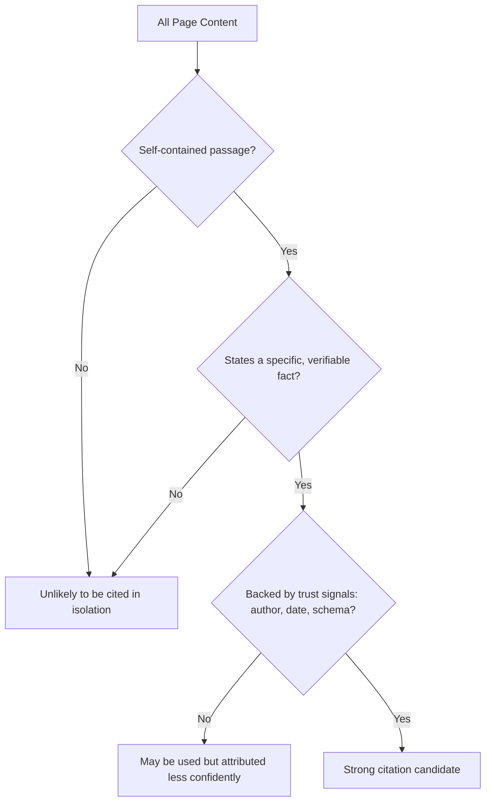

# Chapter 7: AI Citations & Passage-Level Citability

**Version:** 1.0

---

# Table of Contents

1. Introduction
2. What Makes a Passage Citable
3. The Self-Contained Passage Principle
4. Answer-First Writing
5. Fact Density and Specificity
6. Structural Signals That Aid Extraction
7. Authorship, Dates, and Trust Signals
8. Writing for Multiple Chunk Sizes
9. A Citability Worked Example
10. Diagram: The Citability Funnel
11. Best Practices
12. Common Mistakes
13. Checklist
14. Summary
15. References

---

# 1. Introduction

Across every answer engine covered in [Chapters 3-6](chapter-03.md), one mechanical fact recurs: content is retrieved, evaluated, and often cited at the level of an individual passage, not an entire page. This chapter distills the practices that make a specific passage more likely to be selected as evidence and attributed as a citation.

---

# 2. What Makes a Passage Citable

A citable passage is one that a retrieval system can lift out of its surrounding page and still have it read as a complete, unambiguous, accurate statement. If a sentence only makes sense with three paragraphs of preceding context, it is a poor citation candidate even if the page as a whole is authoritative and comprehensive.

---

# 3. The Self-Contained Passage Principle

Every important section should be readable and meaningful in isolation:

**Weak (context-dependent):**
> "This is because of how the algorithm weighs it differently."

**Strong (self-contained):**
> "Google's ranking algorithm weighs Core Web Vitals as one signal among many, meaning a page can rank well despite a mediocre CWV score if other relevance and authority signals are strong."

The strong version names its subject explicitly rather than relying on a pronoun ("it," "this") whose referent lives outside the passage.

---

# 4. Answer-First Writing

Lead each section with the direct answer or claim, then support it with explanation, nuance, or evidence. This mirrors the ranking stage of the RAG pipeline ([Chapter 2, Section 7](chapter-02.md)), which favors passages that state the answer plainly rather than requiring inference across multiple sentences.

| Weak Structure | Strong Structure |
|---|---|
| Build-up → context → answer buried at the end | Direct answer → supporting context/nuance |

---

# 5. Fact Density and Specificity

Passages with concrete, specific facts — numbers, named entities, dates, thresholds — are easier for a retrieval system to verify and cite confidently than vague, qualitative statements. "Largest Contentful Paint should be 2.5 seconds or less" is more citable than "pages should load reasonably quickly."

---

# 6. Structural Signals That Aid Extraction

- **Descriptive subheadings** that state the question or topic the section answers
- **Lists and tables** for enumerable facts (steps, comparisons, specifications)
- **Short paragraphs** — dense multi-topic paragraphs are harder to chunk cleanly
- **Explicit labels** ("Definition:", "Requirement:", "Step 1:") that signal passage type to both readers and extraction systems

---

# 7. Authorship, Dates, and Trust Signals

Citability is not purely about phrasing — it is also about trust. Explicit authorship, publication and modification dates, and matching structured data (`Article` schema — [SEO Book, Chapter 14](../seo/chapter-14.md)) reinforce that a passage's claims come from an identifiable, accountable, current source, feeding directly into the E-E-A-T principles covered in [SEO Book, Chapter 12](../seo/chapter-12.md).

---

# 8. Writing for Multiple Chunk Sizes

Different retrieval systems chunk content at different granularities — some at the sentence level, others at the paragraph or section level. Rather than optimizing for one specific chunk size, aim for a structure where:

- Individual sentences carry complete facts where possible
- Paragraphs cover one clear idea each
- Sections are internally coherent and independently headed

This layered self-containment performs reasonably well regardless of the exact chunking strategy any given system uses.

---

# 9. A Citability Worked Example

**Before (low citability):**
> "There are a few things that matter here. It depends on a lot of factors, but generally speaking, doing this earlier tends to help more than doing it later, and most experts agree it's worth the effort."

**After (high citability):**
> "Structured data should be implemented before a site scales to thousands of pages. Retrofitting schema across an existing large site typically takes 3-5x longer than building it into the initial page templates."

The revised version names the subject, states a concrete claim, and includes a specific, checkable comparison.

---

# 10. Diagram: The Citability Funnel

---

# 11. Best Practices

- Write every important section so it can be lifted out and still make sense
- Lead with the direct answer before elaborating
- Prefer specific, checkable facts over vague qualitative claims
- Use descriptive subheadings, lists, and short paragraphs
- Reinforce visible authorship and dates with matching structured data

---

# 12. Common Mistakes

- Relying on pronouns and implicit context that only resolve earlier in the page
- Burying the actual answer several sentences or paragraphs into a section
- Writing long, multi-topic paragraphs that resist clean chunking
- Omitting visible authorship and date information

---

# 13. Checklist

- [ ] Key sections readable and meaningful in isolation
- [ ] Each section opens with a direct answer or claim
- [ ] Facts are specific and checkable, not vague
- [ ] Subheadings, lists, and short paragraphs used throughout
- [ ] Authorship and dates visible and reinforced with schema

---

# Summary

Because answer engines retrieve and cite content at the passage level, citability is a distinct writing discipline: self-contained passages, answer-first structure, specific and checkable facts, clear structural signals, and visible trust markers. These practices apply consistently across ChatGPT, Google AI Overviews, Perplexity, Gemini, and Claude.

---

# Learning Outcomes

After completing this chapter, you will understand:

- Why passage-level self-containment is the core citability principle
- How to structure content for answer-first, fact-dense writing
- Which structural signals aid automated extraction
- How authorship and dates reinforce citation trust

---

# References

- Google Search Central: E-E-A-T Guidelines
- Anthropic, OpenAI, Perplexity citation documentation (see [Chapters 3-6](chapter-03.md))

---

**Next:** Chapter 8 – llms.txt & AI Crawler Accessibility
