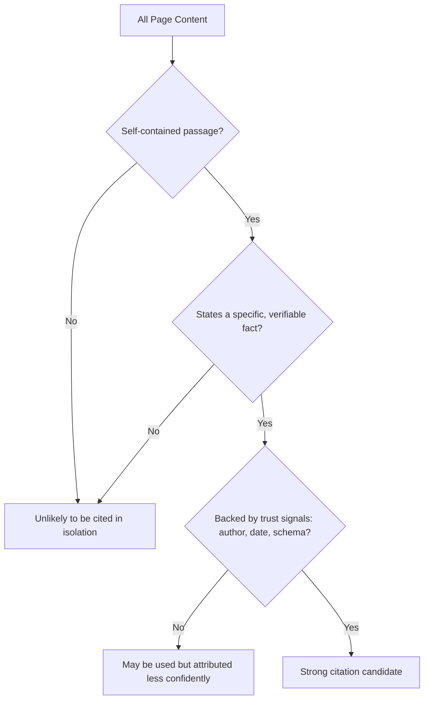

# Chapter 7: AI Citations & Passage-Level Citability

**Version:** 1.0

---

# Table of Contents

1. Introduction
2. What Makes a Passage Citable
3. The Self-Contained Passage Principle
4. Answer-First Writing
5. Fact Density and Specificity
5a. What the Research Actually Measured
6. Structural Signals That Aid Extraction
7. Authorship, Dates, and Trust Signals
8. Writing for Multiple Chunk Sizes
9. A Citability Worked Example
10. Diagram: The Citability Funnel
11. Best Practices
12. Common Mistakes
13. Checklist
14. Summary
15. References

---

# 1. Introduction

Across every answer engine covered in [Chapters 3-6](chapter-03.md), one mechanical fact recurs: content is retrieved, evaluated, and often cited at the level of an individual passage, not an entire page. This chapter distills the practices that make a specific passage more likely to be selected as evidence and attributed as a citation.

---

# 2. What Makes a Passage Citable

A citable passage is one that a retrieval system can lift out of its surrounding page and still have it read as a complete, unambiguous, accurate statement. If a sentence only makes sense with three paragraphs of preceding context, it is a poor citation candidate even if the page as a whole is authoritative and comprehensive.

---

# 3. The Self-Contained Passage Principle

Every important section should be readable and meaningful in isolation:

**Weak (context-dependent):**
> "This is because of how the algorithm weighs it differently."

**Strong (self-contained):**
> "Google's ranking algorithm weighs Core Web Vitals as one signal among many, meaning a page can rank well despite a mediocre CWV score if other relevance and authority signals are strong."

The strong version names its subject explicitly rather than relying on a pronoun ("it," "this") whose referent lives outside the passage.

---

# 4. Answer-First Writing

Lead each section with the direct answer or claim, then support it with explanation, nuance, or evidence. This mirrors the ranking stage of the RAG pipeline ([Chapter 2, Section 7](chapter-02.md)), which favors passages that state the answer plainly rather than requiring inference across multiple sentences.

| Weak Structure | Strong Structure |
|---|---|
| Build-up → context → answer buried at the end | Direct answer → supporting context/nuance |

---

# 5. Fact Density and Specificity

Passages with concrete, specific facts — numbers, named entities, dates, thresholds — are easier for a retrieval system to verify and cite confidently than vague, qualitative statements. "Largest Contentful Paint should be 2.5 seconds or less" is more citable than "pages should load reasonably quickly."

This is one of the few citability practices with a measured effect behind it rather than an argument from mechanism — see the next section.

---

# 5a. What the Research Actually Measured

Most advice in this chapter, including the self-containment principle, is reasoning from how retrieval pipelines work ([Chapter 2](chapter-02.md)). It is plausible, but it has not been isolated and tested. One study has done that work, and it is worth separating what is measured from what is inferred.

Aggarwal et al., ["GEO: Generative Engine Optimization"](https://arxiv.org/abs/2311.09735) (KDD 2024) tested nine content interventions across a benchmark of diverse queries, measuring visibility in generated answers. Their headline results:

| Method | Visibility gain (position-adjusted word count) |
|---|---|
| Quotation Addition — add relevant quotations | **+43.6%** |
| Statistics Addition — replace qualitative claims with figures | **+32.8%** |
| Fluency Optimization — improve readability of the prose | **+28.7%** |
| Cite Sources — add citations to authoritative sources | **+27.8%** |
| Technical Terms — use precise domain vocabulary | +18.5% |
| Easy-to-Understand — simplify the language | +14.4% |
| Authoritative — write in a more confident, authoritative register | +12.3% |
| Unique Words | +6.2% |
| **Keyword Stuffing** | **−8.8%** |

Three things in that table matter more than the individual numbers.

**Keyword stuffing actively hurt.** It was the only method to score below baseline. A technique that once moved traditional rankings makes content *less* likely to be cited by a generative engine — concrete evidence that AEO is not SEO with new labels ([Chapter 1](chapter-01.md)).

**Grounding claims in evidence is the strongest lever tested.** Three of the four highest-scoring methods — quotations, statistics, and explicit citations — work by tying assertions to something checkable. (The fourth, fluency, is about prose quality rather than evidence.) Content that visibly rests on identifiable evidence gets cited more than content that merely asserts, so the instinct to hoard authority by never referencing anyone else is counterproductive. Note the ordering, too: *quoting* an authority outperformed *becoming* one — Quotation Addition scored +43.6% against Authoritative's +12.3%.

**Effect sizes are not universal.** The authors are explicit that "the efficacy of these strategies varies across domains, underscoring the need for domain-specific optimization methods." Authoritative phrasing performed best in Debate and History; Statistics Addition in Law & Government and Opinion; Quotation Addition in People & Society, Explanation, and History. Treat the table as evidence that these levers exist, not as a ranked to-do list to apply uniformly.

---

# 6. Structural Signals That Aid Extraction

- **Descriptive subheadings** that state the question or topic the section answers
- **Lists and tables** for enumerable facts (steps, comparisons, specifications)
- **Short paragraphs** — dense multi-topic paragraphs are harder to chunk cleanly
- **Explicit labels** ("Definition:", "Requirement:", "Step 1:") that signal passage type to both readers and extraction systems

---

# 7. Authorship, Dates, and Trust Signals

Citability is not purely about phrasing — it is also about trust. Explicit authorship, publication and modification dates, and matching structured data (`Article` schema — [SEO Book, Chapter 14](../seo/chapter-14.md)) reinforce that a passage's claims come from an identifiable, accountable, current source, feeding directly into the E-E-A-T principles covered in [SEO Book, Chapter 12](../seo/chapter-12.md).

---

# 8. Writing for Multiple Chunk Sizes

Different retrieval systems chunk content at different granularities — some at the sentence level, others at the paragraph or section level. Rather than optimizing for one specific chunk size, aim for a structure where:

- Individual sentences carry complete facts where possible
- Paragraphs cover one clear idea each
- Sections are internally coherent and independently headed

This layered self-containment performs reasonably well regardless of the exact chunking strategy any given system uses.

---

# 9. A Citability Worked Example

**Before (low citability):**
> "There are a few things that matter here. It depends on a lot of factors, but generally speaking, doing this earlier tends to help more than doing it later, and most experts agree it's worth the effort."

**After (high citability):**
> "Largest Contentful Paint measures how long a page's main content takes to become visible. Google treats 2.5 seconds or less as 'Good', and assesses it using field data from real visits via the Chrome User Experience Report rather than lab simulation ([Google Search Central](https://developers.google.com/search/docs/appearance/core-web-vitals))."

The revised version names its subject in the first words, states a concrete threshold, and attributes the claim to a source a reader — or a model — can check.

Note what the "after" version does *not* do: invent a number to sound precise. A fabricated statistic has the surface texture of a citable fact and none of the substance, and it is worse than a vague sentence, because a vague sentence merely fails to get cited while a wrong one gets cited and spreads. If you cannot source a figure, write the qualitative claim honestly instead.

---

# 10. Diagram: The Citability Funnel

---

# 11. Best Practices

- Write every important section so it can be lifted out and still make sense
- Lead with the direct answer before elaborating
- Prefer specific, checkable facts over vague qualitative claims
- Use descriptive subheadings, lists, and short paragraphs
- Reinforce visible authorship and dates with matching structured data
- Quote and cite identifiable sources — the two strongest levers measured by Aggarwal et al.
- Source every figure you publish; write the claim qualitatively if you cannot

---

# 12. Common Mistakes

- Relying on pronouns and implicit context that only resolve earlier in the page
- Burying the actual answer several sentences or paragraphs into a section
- Writing long, multi-topic paragraphs that resist clean chunking
- Omitting visible authorship and date information
- Keyword stuffing — measurably *reduces* citability (−8.8%), unlike its historical effect on rankings
- Inventing statistics to make a passage feel specific: a fabricated figure is more damaging than a vague sentence, because it gets cited and propagated
- Assuming a tactic's measured effect transfers across domains or platforms without checking

---

# 13. Checklist

- [ ] Key sections readable and meaningful in isolation
- [ ] Each section opens with a direct answer or claim
- [ ] Facts are specific and checkable, not vague
- [ ] Every figure traces to a source the reader can follow
- [ ] Relevant quotations and citations to authoritative sources included
- [ ] No keyword stuffing
- [ ] Subheadings, lists, and short paragraphs used throughout
- [ ] Authorship and dates visible and reinforced with schema

---

# Summary

Because answer engines retrieve and cite content at the passage level, citability is a distinct writing discipline: self-contained passages, answer-first structure, specific and checkable facts, clear structural signals, and visible trust markers.

Be careful how far you generalize that. It is tempting to claim these practices work identically across ChatGPT, Google AI Overviews, Perplexity, Gemini, and Claude, but the evidence does not support it. Aggarwal et al. found effect sizes varying substantially by query domain within a single engine. Across engines, Zhang et al. measured citation behaviour over 602 controlled prompts and found the platforms behave differently in kind: Perplexity and Google cite more sources on average, while ChatGPT cites fewer but draws more heavily on each one.

Their work also splits a distinction this chapter has been blurring. Being *selected* as a citation and being *absorbed* into the generated answer are different outcomes, and optimizing for one does not guarantee the other. Encouragingly for the advice above, they find that high-influence citations tend to be longer, well-structured, and to carry extractable evidence — definitions, facts, procedural steps — which is independent support for the structural signals in Section 6.

What generalizes is the mechanism: retrieval happens at the passage level, so a passage that cannot stand alone cannot be cited alone. What does not generalize is any specific tactic's effect size. Write for the mechanism, and verify against the platform you actually care about rather than trusting a number — including the numbers in this chapter.

---

# Learning Outcomes

After completing this chapter, you will understand:

- Why retrieval happens at the passage level, and what self-containment follows from that
- How to structure content for answer-first, fact-dense writing
- Which content interventions have a measured effect on citation, which are reasoning from mechanism, and why the difference matters
- Why keyword stuffing, a traditional SEO tactic, measurably reduces citability
- Which structural signals aid automated extraction
- How authorship and dates reinforce citation trust
- Why effect sizes vary by domain and platform, and should be verified rather than assumed

---

# References

- Aggarwal et al., ["GEO: Generative Engine Optimization"](https://arxiv.org/abs/2311.09735) (KDD 2024) — the foundational study; source of the nine tested methods and their measured effect sizes in Section 5a
- Zhang et al., ["From Citation Selection to Citation Absorption: A Measurement Framework for Generative Engine Optimization Across AI Search Platforms"](https://arxiv.org/abs/2604.25707) (2026) — cross-platform citation behaviour over 602 controlled prompts
- Google Search Central: [Creating Helpful, Reliable, People-First Content](https://developers.google.com/search/docs/fundamentals/creating-helpful-content) — Google's documentation of E-E-A-T
- Google Search Central: [Understanding Core Web Vitals and Google search results](https://developers.google.com/search/docs/appearance/core-web-vitals) — source of the LCP threshold used in the Section 9 example

---

**Next:** Chapter 8 – llms.txt & AI Crawler Accessibility
