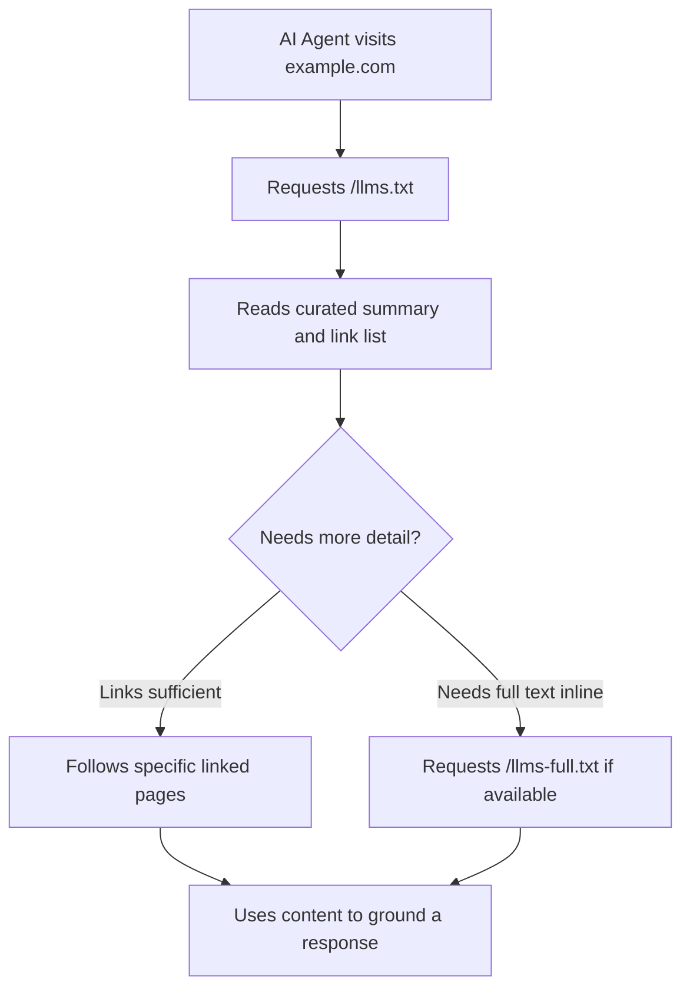

# Chapter 8: llms.txt & AI Crawler Accessibility

**Version:** 1.0

---

# Table of Contents

1. Introduction
2. What is llms.txt?
3. llms.txt vs. robots.txt vs. sitemap.xml
4. llms.txt File Structure
5. llms-full.txt
6. Writing an Effective llms.txt
7. AI Crawler Directory
8. Auditing AI Crawler Accessibility
9. JavaScript Rendering and AI Crawlers
10. Diagram: How an AI Agent Might Use llms.txt
11. Best Practices
12. Common Mistakes
13. Checklist
14. Summary
15. References

---

# 1. Introduction

`llms.txt` is a proposed convention for giving large language models and AI agents a concise, curated entry point into a site's most important content — distinct from `robots.txt` (which governs crawl permissions) and `sitemap.xml` (which lists every URL for traditional indexing). This chapter covers the convention, current adoption status, and the broader question of AI crawler accessibility it sits within.

---

# 2. What is llms.txt?

Proposed by Jeremy Howard in 2024, `llms.txt` is a Markdown file placed at a site's root (`/llms.txt`) that provides a short, human- and LLM-readable summary of the site along with curated links to its most important pages — intended to help an LLM or AI agent quickly understand what a site is about and where to find authoritative information, without having to crawl and infer structure from scratch.

**Adoption status:** as of this writing, `llms.txt` is a community-proposed convention, not an officially confirmed standard adopted by OpenAI, Google, Anthropic, or Perplexity for their production retrieval systems. It is nonetheless a low-cost, low-risk addition that anticipates likely direction, and a growing number of developer tools and documentation platforms already generate or consume it.

---

# 3. llms.txt vs. robots.txt vs. sitemap.xml

| File | Purpose | Audience |
|---|---|---|
| `robots.txt` | Crawl permission rules ([SEO Book, Chapter 3](../seo/chapter-03.md)) | All crawlers, including AI bots |
| `sitemap.xml` | Exhaustive list of indexable URLs | Traditional search crawlers |
| `llms.txt` | Curated, human-readable summary and link list of the most important content | LLMs and AI agents |

These are complementary, not redundant: `robots.txt` controls *whether* a crawler can access content, `sitemap.xml` tells traditional crawlers *what exists*, and `llms.txt` tells an LLM *what matters most and where to start*.

---

# 4. llms.txt File Structure

```markdown
# Example Corp

> Example Corp provides SEO and AI search optimization tools and documentation.

## Documentation

- [Getting Started](https://example.com/docs/getting-started): Setup and first steps
- [API Reference](https://example.com/docs/api): Full API documentation

## Guides

- [SEO Fundamentals](https://example.com/guides/seo): Core SEO concepts
- [AEO Guide](https://example.com/guides/aeo): Answer engine optimization

## Optional

- [Blog](https://example.com/blog): Company blog and announcements
```

The convention: an H1 with the site/project name, a blockquote summary, then H2-labeled sections grouping links with short descriptions. An `## Optional` section signals lower-priority links that can be skipped under context constraints.

---

# 5. llms-full.txt

A companion convention, `llms-full.txt`, provides the full expanded text content (not just links) for cases where an LLM's context window can accommodate ingesting complete documentation directly — most relevant for developer tools and API documentation sites where an agent may need the full reference inline rather than following links.

---

# 6. Writing an Effective llms.txt

- Keep the summary blockquote to 1-3 sentences of genuinely distinguishing information, not marketing copy
- Curate deliberately — list the pages that best represent the site's authoritative content, not every page
- Group links logically (documentation, guides, reference, optional)
- Keep link descriptions short and factual
- Regenerate automatically from the same source of truth as the site's navigation/sitemap, rather than maintaining it by hand — see `scripts/llms_txt_generator.py` in this repository

---

# 7. AI Crawler Directory

| Crawler | Operator | Purpose |
|---|---|---|
| `GPTBot` | OpenAI | Model training data |
| `OAI-SearchBot` | OpenAI | ChatGPT Search retrieval |
| `ChatGPT-User` | OpenAI | Live fetch during active user conversations |
| `Google-Extended` | Google | Gemini/Vertex AI training and grounding |
| `PerplexityBot` | Perplexity | Search retrieval |
| `ClaudeBot` | Anthropic | Crawling for training and search grounding |
| `Bingbot` | Microsoft | Bing indexing, powers Copilot in part |
| `CCBot` | Common Crawl | Open dataset used by many downstream LLM developers |

This list changes as vendors introduce new, more granular crawlers (as OpenAI and Google have both done) — treat it as a snapshot to verify against current documentation, not a permanent reference.

---

# 8. Auditing AI Crawler Accessibility

A proper audit checks, for each crawler in Section 7:

1. Is it explicitly allowed or disallowed in `robots.txt`, or left to the default (allowed)?
2. Does that match the site's actual intent (visible in AI answers vs. opted out of training)?
3. Are there any blanket rules (e.g., blocking all bots matching a pattern) that unintentionally catch AI crawlers?

Automate this check — see `scripts/llms_validator.py` in this repository — rather than relying on manual `robots.txt` review, since crawler lists change over time.

---

# 9. JavaScript Rendering and AI Crawlers

Many AI crawlers have more limited JavaScript rendering capability than Googlebot, which invests heavily in rendering modern web apps ([SEO Book, Chapter 4](../seo/chapter-04.md)). Content that depends entirely on client-side JavaScript to render may be invisible to some AI crawlers even when it is fully visible to Googlebot. Server-side rendering or static generation for key content reduces this risk across the widest range of crawlers.

---

# 10. Diagram: How an AI Agent Might Use llms.txt



---

# 11. Best Practices

- Publish both `robots.txt` (permissions) and `llms.txt` (curated summary) — they serve different purposes
- Generate `llms.txt` from the same structured source as site navigation, not maintained by hand
- Explicitly and deliberately configure each known AI crawler user agent rather than relying on defaults
- Ensure key content is server-rendered or statically generated, not JavaScript-only
- Re-audit crawler configuration periodically as new AI crawlers are introduced

---

# 12. Common Mistakes

- Treating `llms.txt` as a confirmed, universally-honored standard rather than an emerging convention
- Letting `llms.txt` go stale relative to the actual site structure
- Using a blanket bot-blocking rule that unintentionally blocks legitimate AI search crawlers
- Assuming AI crawlers render JavaScript as capably as Googlebot

---

# 13. Checklist

- [ ] `llms.txt` published at site root with curated, current links
- [ ] `llms-full.txt` published if the site is documentation-heavy
- [ ] Each known AI crawler explicitly configured in `robots.txt`, not left to default
- [ ] Key content verified to render without requiring client-side JavaScript
- [ ] Crawler accessibility audit automated and run on a recurring schedule

---

# Summary

`llms.txt` is an emerging, not-yet-universally-adopted convention for giving LLMs a curated entry point into a site's key content, complementing (not replacing) `robots.txt` and `sitemap.xml`. Combined with deliberate, explicit AI crawler configuration and JavaScript-independent rendering of key content, it forms the technical accessibility foundation every other AEO tactic in this book depends on.

---

# Learning Outcomes

After completing this chapter, you will understand:

- What llms.txt is, its structure, and its current adoption status
- How llms.txt differs from and complements robots.txt and sitemap.xml
- The current landscape of major AI crawler user agents
- Why JavaScript rendering matters specifically for AI crawler accessibility

---

# References

- llmstxt.org: The llms.txt Proposal
- Individual vendor crawler documentation (OpenAI, Google, Anthropic, Perplexity)

---

**Next:** Chapter 9 – Prompt Engineering for AEO
