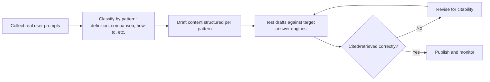

# Chapter 9: Prompt Engineering for AEO

**Version:** 1.0

---

# Table of Contents

1. Introduction
2. Two Directions of Prompt Engineering in AEO
3. Reverse-Engineering User Prompts
4. Prompt Patterns and Their Content Implications
5. Writing Content Prompt-Aware
6. Testing Content Against Real Prompts
7. Prompt Engineering for Internal AEO Tooling
8. System Prompts, RAG Context, and Brand Voice
9. Diagram: Prompt-Aware Content Workflow
10. Best Practices
11. Common Mistakes
12. Checklist
13. Summary
14. References

---

# 1. Introduction

Prompt engineering shows up in AEO in two distinct ways: understanding how *users* phrase prompts to answer engines (so content can be structured to answer those exact questions), and using prompt engineering *internally* to build the AEO tooling — audits, briefs, extraction tests — that support the rest of this book's practices. This chapter covers both.

---

# 2. Two Directions of Prompt Engineering in AEO

| Direction | Focus | Where It's Used |
|---|---|---|
| Outward-facing | Understanding and matching real user prompt patterns | Content planning, FAQ structuring |
| Inward-facing | Using LLMs as tools to audit, test, and generate AEO content | Content briefs, citability testing, automation |

---

# 3. Reverse-Engineering User Prompts

Unlike traditional keyword research ([SEO Book, Chapter 8](../seo/chapter-08.md)), AEO content planning benefits from collecting actual full-sentence prompts users type into AI chat interfaces, not just short keyword phrases. Sources for this include:

- Customer support transcripts and chat logs
- "People also ask" and related-question data from traditional SERPs
- Direct testing: asking target answer engines a range of phrasings and observing what triggers a citation-worthy response
- Community forums and Q&A sites where users phrase questions naturally

---

# 4. Prompt Patterns and Their Content Implications

| Prompt Pattern | Example | Content Implication |
|---|---|---|
| Direct definition | "What is Core Web Vitals?" | A clear, quotable definition near the top of the page |
| Comparison | "ChatGPT vs. Perplexity for research" | A structured comparison table |
| Instructional | "How do I fix a noindex tag issue?" | Numbered, step-based instructions |
| Recommendation | "Best schema generator for JSON-LD" | Criteria-based, evaluative content, not just a listicle |
| Troubleshooting | "Why is my page not showing rich results?" | Diagnostic content covering common causes and fixes |

Mapping content to these patterns mirrors the answer-first writing principle from [Chapter 7](chapter-07.md), applied specifically to how real prompts are phrased.

---

# 5. Writing Content Prompt-Aware

Being "prompt-aware" means writing sections that anticipate the actual phrasing a user might type into an AI assistant, not just the keyword a traditional SEO brief would target. Practically, this means:

- Using FAQ headers phrased as full natural questions ("How do I...", "What is...", "Why does...")
- Anticipating follow-up prompts, not just the initial question (see [Chapter 3, Section 6](chapter-03.md))
- Covering the comparison, troubleshooting, and recommendation angles of a topic, not only its definition

---

# 6. Testing Content Against Real Prompts

Before publishing, test draft content against the actual answer engines it targets:

1. Draft a set of realistic prompts covering the patterns in Section 4
2. Query each target answer engine directly (or via API where available)
3. Check whether the draft page (once published, or a staging URL where crawlable) is retrieved, cited, or absent
4. Revise passages that are absent or misrepresented, applying the citability principles from [Chapter 7](chapter-07.md)

This is the AEO equivalent of a SERP-preview check in traditional SEO — testing against the actual system before assuming a content structure will work.

---

# 7. Prompt Engineering for Internal AEO Tooling

LLMs can be used directly as part of the AEO workflow itself:

- **Content brief generation** — prompting an LLM to draft a brief covering the prompt patterns in Section 4 for a given topic
- **Citability review** — prompting an LLM to flag passages that rely on unresolved pronouns or missing context (see [Chapter 7, Section 3](chapter-07.md))
- **FAQ extraction** — prompting an LLM to generate candidate FAQ questions from existing long-form content, then verifying and refining them manually
- **Extraction simulation** — prompting an LLM with only a single passage (no surrounding page) and checking whether it can still answer correctly, as a proxy for chunked-retrieval performance

Prompts used for this internal tooling should be version-controlled and treated as part of the content production pipeline, not ad hoc one-off queries.

---

# 8. System Prompts, RAG Context, and Brand Voice

For organizations building their own AI-powered search or support experiences (internal RAG systems, branded chat widgets), prompt engineering also covers how retrieved content is presented to the underlying model via system prompts — instructing it on citation format, tone, and how to handle content gaps. This is a distinct, product-level application of prompt engineering, related to but separate from optimizing for third-party answer engines.

---

# 9. Diagram: Prompt-Aware Content Workflow

---

# 10. Best Practices

- Collect real, full-sentence user prompts, not just short keyword phrases
- Structure content explicitly around definition, comparison, how-to, recommendation, and troubleshooting patterns
- Test draft content against real answer engines before considering it finished
- Version-control internal AEO prompts used for briefs, audits, and extraction testing

---

# 11. Common Mistakes

- Reusing traditional keyword research unchanged instead of collecting real conversational prompts
- Writing FAQ headers in keyword-fragment style instead of natural question phrasing
- Skipping the post-publish testing step against actual answer engines
- Treating internal LLM tooling prompts as disposable rather than a maintained part of the workflow

---

# 12. Checklist

- [ ] Real user prompts collected from support logs, forums, or direct testing
- [ ] Content mapped to definition/comparison/how-to/recommendation/troubleshooting patterns
- [ ] FAQ headers phrased as natural full questions
- [ ] Draft content tested against target answer engines before publishing
- [ ] Internal AEO tooling prompts version-controlled

---

# Summary

Prompt engineering supports AEO in two directions: understanding how real users phrase questions to answer engines so content can be structured to match, and using LLMs as internal tools to draft, audit, and test that content. Prompt-aware content mapped to common question patterns and validated against real answer engines closes the loop between writing and measurable citation performance.

---

# Learning Outcomes

After completing this chapter, you will understand:

- The two distinct roles prompt engineering plays in AEO
- How to reverse-engineer real user prompt patterns
- How to test content against actual answer engines before publishing
- How LLMs can be used as internal tooling for AEO content production

---

# References

- OpenAI, Anthropic, and Google prompt engineering documentation
- This book's own [Chapter 7](chapter-07.md) on passage-level citability

---

**Next:** Chapter 10 – AEO Measurement & Analytics
