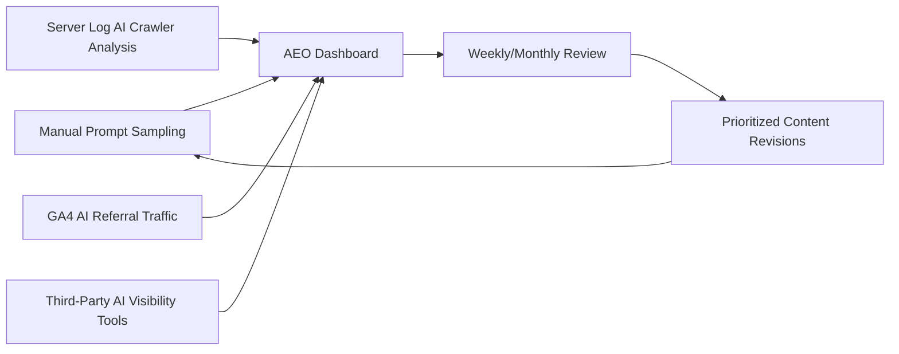

# Chapter 10: AEO Measurement & Analytics

**Version:** 1.0

---

# Table of Contents

1. Introduction
2. Why AEO Measurement Is Harder Than SEO Measurement
3. Core AEO Metrics
4. Manual Prompt Sampling
5. Server Log Analysis for AI Crawlers
6. Referral Traffic from AI Platforms
7. Third-Party AI Visibility Tools
8. Building an AEO Measurement Dashboard
9. Tying AEO to Business Outcomes
10. Diagram: AEO Measurement Pipeline
11. Best Practices
12. Common Mistakes
13. Checklist
14. Summary
15. Book Summary: Putting It All Together
16. References

---

# 1. Introduction

Traditional SEO measurement ([SEO Book, Chapter 20](../seo/chapter-20.md)) has mature, standardized tools: Search Console, GA4, rank trackers. AEO measurement is younger, more fragmented, and partly manual — but it is not optional. This closing chapter covers the practical methods available today for measuring AI search visibility and ties the whole book together.

---

# 2. Why AEO Measurement Is Harder Than SEO Measurement

- No universal "Search Console equivalent" exists across all answer engines
- Citation behavior varies by platform (inline numbered citations vs. source cards vs. no visible attribution at all)
- Many answer engine responses are not publicly logged or easily sampled at scale
- AI referral traffic is often under-tagged or misclassified in analytics platforms by default

---

# 3. Core AEO Metrics

| Metric | Description | Primary Source |
|---|---|---|
| Citation frequency | How often a domain/page is cited for a defined set of target prompts | Manual sampling, third-party tools |
| Share of voice | Citation frequency relative to competitors for the same prompt set | Manual sampling, third-party tools |
| AI referral traffic | Sessions arriving from AI platform referrers | GA4 (with correct channel configuration) |
| AI crawler activity | Server-side requests from known AI crawler user agents | Server logs |
| Sentiment/accuracy of citations | Whether the AI's summary of a brand/product is accurate and favorable | Manual review |

---

# 4. Manual Prompt Sampling

The most reliable current method: define a fixed panel of representative prompts (from the patterns in [Chapter 9, Section 4](chapter-09.md)), run them against each target answer engine on a recurring schedule, and record whether the target domain is cited, how prominently, and what was said. This is labor-intensive but is the ground truth most third-party tools are themselves approximating.

---

# 5. Server Log Analysis for AI Crawlers

Analyzing raw server/CDN logs for requests from the AI crawler user agents listed in [Chapter 8, Section 7](chapter-08.md) reveals:

- Which AI crawlers are actively visiting the site (confirming `robots.txt` configuration is working as intended)
- Which pages are fetched most often by AI crawlers — a leading indicator of likely citation candidates
- Crawl frequency trends over time

This data exists regardless of whether a given platform exposes citation-level reporting, making it one of the few universally available AEO signals.

---

# 6. Referral Traffic from AI Platforms

AI platforms that link back to sources (ChatGPT Search, Perplexity, Copilot) can generate measurable referral traffic. In GA4, verify that:

- AI platform referrers are not being misclassified as "Direct" traffic (a common default-configuration issue)
- A custom channel grouping or regex-based source/medium rule is defined to isolate AI referral traffic for trend analysis, mirroring the organic segmentation covered in [SEO Book, Chapter 20, Section 4](../seo/chapter-20.md)

---

# 7. Third-Party AI Visibility Tools

A growing category of tools automates prompt sampling and citation tracking across multiple answer engines, providing time-series brand citation rates and competitive share-of-voice reporting. These tools reduce the manual burden of Section 4 but should be validated periodically against direct manual spot-checks, since methodology and coverage vary by vendor.

---

# 8. Building an AEO Measurement Dashboard

A useful AEO dashboard consolidates:

- Citation frequency and share of voice, trended over time, per answer engine
- AI crawler request volume from server logs
- AI referral traffic and conversions from GA4
- A qualitative log of notable citation content (accurate vs. inaccurate representations)

As with the SEO dashboard in [SEO Book, Chapter 20, Section 9](../seo/chapter-20.md), automate data collection wherever an API or log pipeline exists, reserving manual review for qualitative judgment calls.

---

# 9. Tying AEO to Business Outcomes

Citation frequency and AI referral traffic are leading indicators, not the end goal. Where possible, connect AEO metrics to downstream business outcomes — branded search lift following increased citation frequency, conversion rates from AI-referred sessions, and qualitative brand perception — using the same outcome-first discipline recommended for SEO KPIs in [SEO Book, Chapter 20, Section 2](../seo/chapter-20.md).

---

# 10. Diagram: AEO Measurement Pipeline

---

# 11. Best Practices

- Combine manual prompt sampling with automated log and referral-traffic analysis — no single source is sufficient alone
- Validate third-party AI visibility tools against manual spot-checks periodically
- Configure GA4 to correctly classify AI platform referral traffic rather than trusting default settings
- Tie citation and referral metrics back to business outcomes, not just visibility counts

---

# 12. Common Mistakes

- Relying solely on a single third-party tool without validating its methodology
- Letting AI referral traffic get silently absorbed into "Direct" traffic in analytics
- Treating citation frequency as an end goal rather than a leading indicator
- Sampling too small or unrepresentative a prompt panel to draw reliable conclusions

---

# 13. Checklist

- [ ] A representative prompt panel defined and sampled on a recurring schedule
- [ ] Server logs analyzed for AI crawler activity
- [ ] GA4 configured to correctly classify AI platform referral traffic
- [ ] Third-party AI visibility tooling in place and periodically validated manually
- [ ] AEO metrics connected to downstream business outcomes

---

# Summary

AEO measurement is younger and more fragmented than traditional SEO analytics, requiring a combination of manual prompt sampling, server log analysis, correctly configured referral tracking, and (optionally) third-party visibility tools. No single source is sufficient — a credible measurement practice triangulates across all of them and ties results back to business outcomes.

---

# Book Summary: Putting It All Together

This book has built AEO from mechanism to measurement:

- **Foundations** ([Ch. 1-2](chapter-01.md)): what AEO is, and the shared retrieval-augmented-generation pipeline behind every answer engine
- **Platform-Specific Optimization** ([Ch. 3-6](chapter-03.md)): ChatGPT Search, Google AI Overviews, Perplexity, Gemini, and Claude — each with distinct crawlers, citation behaviors, and content preferences
- **Citability and Accessibility** ([Ch. 7-8](chapter-07.md)): writing self-contained, citable passages, and ensuring AI crawlers can actually reach them via llms.txt and deliberate crawler configuration
- **Prompt Awareness and Measurement** ([Ch. 9-10](chapter-09.md)): structuring content around real user prompt patterns, and measuring citation performance across a fragmented tooling landscape

AEO does not replace the SEO fundamentals in the companion **SEO Book** — it extends them into a world where the search result is increasingly a synthesized answer rather than a ranked list of links. The companion **GEO Book** (`docs/books/complete/geo/`) goes one level deeper into the underlying technology — knowledge graphs, embeddings, vector search, and RAG — that powers the answer engines covered throughout this book.

---

# Learning Outcomes

After completing this chapter, you will understand:

- Why AEO measurement is more fragmented than traditional SEO analytics
- The core metrics available today and their primary data sources
- How to build a triangulated AEO measurement dashboard
- How the full AEO discipline fits together, from mechanism to measurement

---

# References

- GA4 Documentation: Custom Channel Groupings
- Server log analysis tooling documentation (see `scripts/` in this repository)

---

**This concludes the AEO Book.** Continue to the **GEO Book** (`docs/books/complete/geo/`) for the underlying technology behind generative and AI-powered search.
