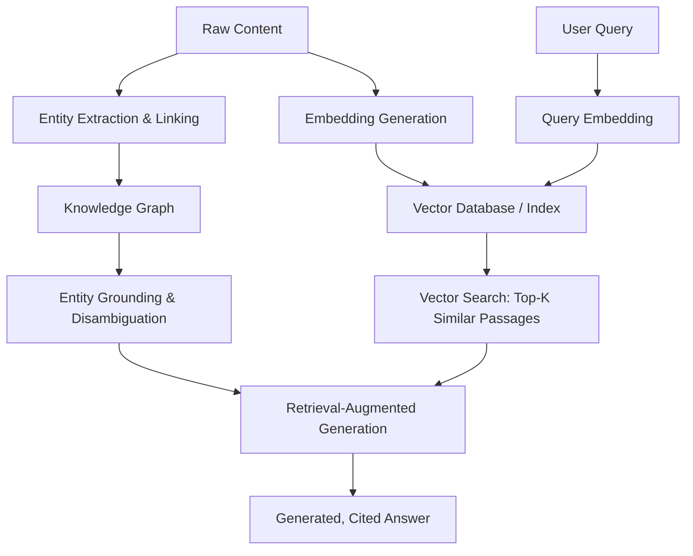

# Chapter 1: Introduction to Generative Engine Optimization

**Version:** 1.0

---

# Table of Contents

1. What is Generative Engine Optimization?
2. GEO vs. AEO vs. SEO
3. Why GEO Requires Understanding the Underlying Technology
4. The Technology Stack Behind Generative Search
5. Who This Book Is For
6. How This Book Is Organized
7. A Preview: From Text to Answer
8. Best Practices
9. Common Mistakes
10. Getting Started Checklist
11. Summary
12. References

---

# 1. What is Generative Engine Optimization?

Generative Engine Optimization (GEO) is the discipline of understanding and optimizing for the underlying technologies that power AI-generated search and answer systems: knowledge graphs, entity resolution, semantic search, embeddings, vector retrieval, and retrieval-augmented generation (RAG). Where the [AEO Book](../aeo/README.md) focuses on platform-specific tactics for ChatGPT, Perplexity, Gemini, and Claude, this book goes one level deeper into *how* those systems represent, retrieve, and reason over content in the first place.

---

# 2. GEO vs. AEO vs. SEO

| Discipline | Layer | Core Question |
|---|---|---|
| SEO ([SEO Book](../seo/README.md)) | Crawling, indexing, ranking | Can this page be found and ranked for a query? |
| AEO ([AEO Book](../aeo/README.md)) | Platform-specific answer engines | Will this specific answer engine cite this content? |
| GEO (this book) | Underlying AI/retrieval technology | How do machines represent meaning, and how can content be structured for that representation? |

These three layers are cumulative, not competing: strong SEO fundamentals make content retrievable, strong AEO tactics make it citable on specific platforms, and strong GEO understanding explains *why* those tactics work at a mechanical level — and lets you anticipate new platforms and techniques before they become mainstream.

---

# 3. Why GEO Requires Understanding the Underlying Technology

AEO tactics like "write self-contained passages" ([AEO Book, Chapter 7](../aeo/chapter-07.md)) work because of specific technical mechanisms: embeddings that represent meaning as vectors, retrieval systems that rank by vector similarity, and knowledge graphs that resolve entities. Understanding these mechanisms — covered chapter by chapter in this book — turns tactical advice into a transferable mental model that keeps working as platforms and models change.

---

# 4. The Technology Stack Behind Generative Search

Each layer in this diagram is the subject of its own chapter: knowledge graphs ([Chapter 2](chapter-02.md)), entities ([Chapter 3](chapter-03.md)), semantic search ([Chapter 4](chapter-04.md)), embeddings ([Chapter 5](chapter-05.md)), vector search ([Chapter 6](chapter-06.md)), and RAG ([Chapter 7](chapter-07.md)).

---

# 5. Who This Book Is For

This book is written for SEO and content practitioners who want to understand the machinery behind AI search well enough to make better strategic decisions — not for machine learning engineers building these systems from scratch. Concepts are explained conceptually with enough technical grounding to be actionable, with pointers to deeper technical references for those who want to go further.

---

# 6. How This Book Is Organized

- **[Chapter 2](chapter-02.md)** — Knowledge Graphs: how search engines model real-world entities and relationships
- **[Chapter 3](chapter-03.md)** — Entities & Entity Linking: how content gets connected to the knowledge graph
- **[Chapter 4](chapter-04.md)** — Semantic Search: matching meaning, not just keywords
- **[Chapter 5](chapter-05.md)** — Embeddings: representing meaning as vectors
- **[Chapter 6](chapter-06.md)** — Vector Search & Retrieval: finding relevant content at scale
- **[Chapter 7](chapter-07.md)** — Retrieval-Augmented Generation: how retrieved content becomes a generated answer
- **[Chapter 8](chapter-08.md)** — How LLMs Generate Answers & GEO Strategy: tying it all together

---

# 7. A Preview: From Text to Answer

A single piece of published content travels through all of these systems before it can appear in an AI-generated answer: it is crawled, its entities are extracted and linked to a knowledge graph, its text is embedded into vector space, that vector is indexed for retrieval, a user's query is embedded into the same space, the closest matching passages are retrieved, and a language model generates a grounded answer from them. Every chapter in this book examines one link in that chain.

---

# 8. Best Practices

- Read this book as a companion to the AEO Book, not a replacement — tactics land better once the mechanism is understood
- Focus on the conceptual model of each technology rather than implementation-level ML details, unless building these systems directly
- Revisit AEO tactics after finishing this book — many will make more sense mechanically

---

# 9. Common Mistakes

- Treating GEO as a synonym for AEO rather than the deeper technology layer underneath it
- Skipping straight to tactics without understanding why they work, making it hard to adapt when platforms change
- Assuming knowledge graphs and embeddings are only relevant to engineers, not content strategy

---

# Getting Started Checklist

- [ ] SEO Book and AEO Book fundamentals already understood (this book builds on both)
- [ ] Comfortable with the idea that content is represented and retrieved mathematically, not just matched by keyword
- [ ] Ready to connect each chapter's concept back to a concrete AEO tactic from the companion book

---

# Summary

Generative Engine Optimization is the study of the technology stack — knowledge graphs, entities, embeddings, vector search, and retrieval-augmented generation — that powers AI-generated search and answer systems. Understanding this stack turns the platform-specific tactics in the AEO Book into a durable, transferable mental model rather than a list of tricks that expire when a platform changes.

---

# Learning Outcomes

After completing this chapter, you will understand:

- How GEO relates to and differs from SEO and AEO
- The full technology stack behind generative search, at a conceptual level
- How this book is organized and how to use it alongside the AEO Book

---

# References

- This book's companion volumes: the [SEO Book](../seo/README.md) and [AEO Book](../aeo/README.md)

---

**Next:** Chapter 2 – Knowledge Graphs
