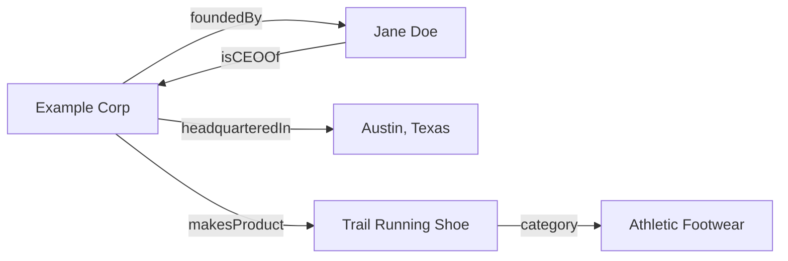

# Chapter 2: Knowledge Graphs

**Version:** 1.0

---

# Table of Contents

1. Introduction
2. What is a Knowledge Graph?
3. Triples: The Basic Unit of Knowledge
4. Google's Knowledge Graph
5. Knowledge Panels
6. Wikidata and Public Knowledge Bases
7. How Knowledge Graphs Are Built
8. Knowledge Graphs and LLM Grounding
9. Getting a Business Into the Knowledge Graph
10. Diagram: A Small Knowledge Graph
11. Best Practices
12. Common Mistakes
13. Checklist
14. Summary
15. References

---

# 1. Introduction

A knowledge graph is a structured representation of real-world entities — people, places, organizations, products, concepts — and the relationships between them. Search engines and AI systems use knowledge graphs to disambiguate meaning, verify facts, and ground generated answers in a structured model of reality rather than relying purely on unstructured text.

---

# 2. What is a Knowledge Graph?

Formally, a knowledge graph is a graph database where nodes represent entities and edges represent typed relationships between them. Unlike a document index, which stores and retrieves text, a knowledge graph stores *facts about things* — enabling queries like "who founded this company" or "what other products does this brand make" to be answered directly rather than inferred from prose.

---

# 3. Triples: The Basic Unit of Knowledge

Knowledge graphs are built from **triples**: (subject, predicate, object).

| Subject | Predicate | Object |
|---|---|---|
| Example Corp | foundedBy | Jane Doe |
| Example Corp | headquarteredIn | Austin, Texas |
| Jane Doe | isCEOOf | Example Corp |

A collection of triples forms a graph: entities (subjects/objects) connected by labeled relationships (predicates). This is the same underlying model as the `sameAs`, `author`, and `publisher` relationships expressed in Schema.org markup ([SEO Book, Chapter 14](../seo/chapter-14.md)) — structured data on a webpage is, in effect, a small set of triples about that page's entities.

---

# 4. Google's Knowledge Graph

Google's Knowledge Graph, launched in 2012, underlies Knowledge Panels, many featured snippets, and increasingly the entity-grounding behind AI Overviews ([AEO Book, Chapter 4](../aeo/chapter-04.md)). It aggregates data from many sources — including Wikipedia, Wikidata, structured data markup, and licensed datasets — to build a confidence-scored model of entities and their relationships.

---

# 5. Knowledge Panels

A Knowledge Panel is the visible surface of the Knowledge Graph: the info box shown alongside search results for a well-established entity (a person, company, or place), summarizing key facts and linking to authoritative sources. Appearing in a Knowledge Panel is a strong signal that an entity has been successfully disambiguated and modeled by Google's Knowledge Graph — directly relevant to the entity SEO practices covered in [SEO Book, Chapter 10](../seo/chapter-10.md).

---

# 6. Wikidata and Public Knowledge Bases

Wikidata is a free, collaboratively edited knowledge base that structures the same kind of factual data found in Wikipedia into machine-readable triples, and is a major input source for Google's Knowledge Graph and many LLM training and retrieval pipelines. Establishing and maintaining an accurate Wikidata entry is one of the most direct, controllable ways an organization can influence how it is represented across multiple knowledge graphs simultaneously.

---

# 7. How Knowledge Graphs Are Built

| Method | Description |
|---|---|
| Structured data ingestion | Parsing Schema.org markup, database exports, and APIs |
| Information extraction | NLP techniques that extract entities and relationships from unstructured text |
| Public knowledge base integration | Importing/aligning with Wikidata, Wikipedia, and other open datasets |
| Human curation and verification | Manual review and correction, particularly for high-confidence facts |

Modern knowledge graph construction typically combines all four, with automated extraction handling scale and human curation handling accuracy for high-stakes facts.

---

# 8. Knowledge Graphs and LLM Grounding

LLM-powered answer engines use knowledge graphs to **ground** generated text in verified facts, reducing hallucination for entity-related queries ("who is the CEO of X," "when was Y founded"). This is distinct from, but complementary to, the retrieval-augmented generation process described in [Chapter 7](chapter-07.md): a knowledge graph provides structured, verified facts, while RAG retrieves and synthesizes relevant unstructured passages. The strongest AI Overview and chat-based answers for entity-centric queries typically combine both.

---

# 9. Getting a Business Into the Knowledge Graph

- Implement `Organization` and `sameAs` schema linking to authoritative external profiles ([SEO Book, Chapter 14, Section 12](../seo/chapter-14.md))
- Create and maintain an accurate Wikidata entry
- Pursue a Wikipedia entry only where genuinely notable per Wikipedia's own guidelines — attempting to force an entry that doesn't meet notability standards typically fails or gets removed
- Ensure NAP and entity facts are consistent across all owned and third-party profiles (see [SEO Book, Chapter 19, Section 4](../seo/chapter-19.md) on NAP consistency)
- Earn citations and mentions from sources the knowledge graph already trusts (major publications, industry databases)

---

# 10. Diagram: A Small Knowledge Graph

---

# 11. Best Practices

- Treat `sameAs` and Wikidata as direct, controllable levers for entity representation
- Keep entity facts (name, founder, location, products) consistent across every owned and third-party surface
- Reinforce structured data claims with genuine, citable third-party sources
- Understand that Knowledge Panel presence reflects successful disambiguation, not a purchasable feature

---

# 12. Common Mistakes

- Treating Wikipedia/Wikidata entries as marketing copy rather than neutral, verifiable factual records
- Letting entity facts drift out of sync across schema, Wikidata, GBP, and the website itself
- Assuming schema markup alone guarantees Knowledge Panel inclusion without independent corroborating sources
- Ignoring entity consistency until after a rebrand or acquisition creates conflicting records

---

# 13. Checklist

- [ ] `Organization` schema with `sameAs` links implemented sitewide
- [ ] Wikidata entry created and kept current
- [ ] Entity facts consistent across schema, Wikidata, GBP, and third-party citations
- [ ] Genuine third-party corroborating sources exist for key entity facts
- [ ] Entity records reviewed after any rebrand, acquisition, or leadership change

---

# Summary

Knowledge graphs model real-world entities and their relationships as structured triples, underlying Knowledge Panels, entity-grounded AI answers, and much of the disambiguation work search and answer engines perform. Businesses influence their own knowledge graph representation primarily through structured data, Wikidata maintenance, and consistent, corroborated entity facts across every public surface.

---

# Learning Outcomes

After completing this chapter, you will understand:

- What a knowledge graph is and how triples represent knowledge
- How Google's Knowledge Graph and Knowledge Panels relate to search
- The role of Wikidata as a shared, influential knowledge base
- How knowledge graphs ground LLM-generated answers in verified facts

---

# References

- Google: Introducing the Knowledge Graph (2012)
- Wikidata: About Wikidata
- Schema.org: Understanding sameAs

---

**Next:** Chapter 3 – Entities & Entity Linking
