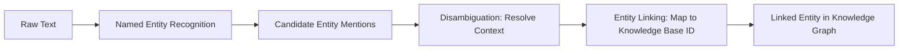

# Chapter 3: Entities & Entity Linking

**Version:** 1.0

---

# Table of Contents

1. Introduction
2. What is an Entity?
3. Named Entity Recognition
4. Entity Disambiguation
5. Entity Linking
6. Entity Salience
7. Entities in Content Strategy
8. Entity-Based Content Gaps
9. Tools for Entity Analysis
10. Diagram: Entity Linking Pipeline
11. Best Practices
12. Common Mistakes
13. Checklist
14. Summary
15. References

---

# 1. Introduction

An entity is any distinct, identifiable thing a piece of content refers to — a person, organization, place, product, or concept. Entity-centric understanding, rather than pure keyword matching, is what allows modern search and AI systems to know that "Apple the company" and "apple the fruit" are different things, and that "Tim Cook" and "the CEO of Apple" refer to the same entity. This chapter covers how entities are recognized, disambiguated, and linked — the process that connects raw content to the knowledge graph from [Chapter 2](chapter-02.md).

---

# 2. What is an Entity?

Entities are typically classified into types: `Person`, `Organization`, `Place`, `Product`, `Event`, and more (the same type vocabulary used by Schema.org — [SEO Book, Chapter 14](../seo/chapter-14.md)). An entity is distinct from a mere keyword: "running shoes" is a topic/keyword, while "TrailCo" (a specific brand) or "Boston Marathon" (a specific event) are entities with a stable, referenceable identity.

---

# 3. Named Entity Recognition

Named Entity Recognition (NER) is the NLP task of identifying entity mentions within text and classifying their type. Given the sentence "Jane Doe joined Example Corp as CEO in 2024," an NER system identifies "Jane Doe" (Person), "Example Corp" (Organization), and "2024" (Date). NER is typically the first step in any pipeline that extracts structured meaning from unstructured content — including the process by which search engines build and update knowledge graphs.

---

# 4. Entity Disambiguation

Disambiguation resolves which specific real-world entity a mention refers to when the name alone is ambiguous. "Jordan" could refer to the country, the athlete Michael Jordan, or numerous people and brands sharing that name. Disambiguation uses surrounding context (co-occurring entities, topic, domain) to resolve the mention to a specific, unique entity — typically represented by a stable identifier such as a Wikidata QID.

---

# 5. Entity Linking

Entity linking connects a disambiguated mention in a piece of content to its corresponding node in a knowledge graph or knowledge base (Wikidata, Google's Knowledge Graph). This is the mechanical step that allows a search engine to know that a specific paragraph on a website is *about* the same "Example Corp" that has a Knowledge Panel, a Wikidata entry, and a set of `sameAs` links ([Chapter 2, Section 9](chapter-02.md)).

---

# 6. Entity Salience

Salience measures how central a given entity is to a piece of content, not merely whether it's mentioned. A news article about a product recall might mention a regulatory agency once in passing (low salience) while the product and manufacturer are central throughout (high salience). Search and AI systems weigh high-salience entity associations more heavily when determining what a page is fundamentally "about" — directly relevant to topical authority and entity SEO ([SEO Book, Chapter 10](../seo/chapter-10.md)).

---

# 7. Entities in Content Strategy

Practical entity-aware content practices:

- Name entities explicitly and consistently rather than relying on pronouns or vague references (reinforces the self-contained passage principle from [AEO Book, Chapter 7](../aeo/chapter-07.md))
- Use full, canonical entity names on first mention in a section, not just abbreviations or nicknames
- Link entity mentions to their own authoritative pages where relevant (internal linking to a product or team-member page, external linking to a Wikipedia/Wikidata entry)
- Ensure high-salience entities for a page are reflected in the title, headings, and structured data — not just buried in body text

---

# 8. Entity-Based Content Gaps

Entity-based gap analysis compares which entities competitors' top-ranking or top-cited content associates with a topic against which entities your own content associates with it — surfacing missing sub-topics, related products, or industry figures that a comprehensive piece should cover. This extends traditional keyword gap analysis ([SEO Book, Chapter 8](../seo/chapter-08.md)) into entity space.

---

# 9. Tools for Entity Analysis

- **Google Natural Language API** — entity extraction and salience scoring for arbitrary text
- **Wikidata Query Service** — exploring entity relationships in the public knowledge graph
- **`scripts/entity_extractor.py`** in this repository — programmatic entity extraction for content audits

---

# 10. Diagram: Entity Linking Pipeline

---

# 11. Best Practices

- Name entities explicitly and consistently rather than relying on pronouns
- Ensure high-salience entities appear in titles, headings, and structured data
- Link entity mentions internally and externally to their authoritative pages
- Run entity-based content gap analysis alongside traditional keyword research

---

# 12. Common Mistakes

- Referring to key entities only by pronoun after the first mention, weakening salience and citability
- Inconsistent naming of the same entity across a site (abbreviations, nicknames, alternate spellings)
- Ignoring entity gaps that competitors' content covers but yours doesn't
- Treating entity extraction as a one-time audit rather than an ongoing content practice

---

# 13. Checklist

- [ ] Key entities named explicitly and consistently throughout content
- [ ] High-salience entities reflected in titles, headings, and schema
- [ ] Entity mentions linked internally and externally where appropriate
- [ ] Entity-based content gap analysis performed against top competitors

---

# Summary

Entity recognition, disambiguation, and linking are the mechanical steps that connect raw content to a knowledge graph, allowing search and AI systems to understand not just what words appear on a page but what real-world things it is fundamentally about. Writing with explicit, consistent, high-salience entity references — and closing entity-based content gaps — strengthens both traditional entity SEO and GEO/AEO performance.

---

# Learning Outcomes

After completing this chapter, you will understand:

- The difference between entities and keywords
- How named entity recognition, disambiguation, and linking work together
- What entity salience means and why it matters for content strategy
- How to perform entity-based content gap analysis

---

# References

- Google Cloud Natural Language API Documentation
- Wikidata Query Service Documentation

---

**Next:** Chapter 4 – Semantic Search
