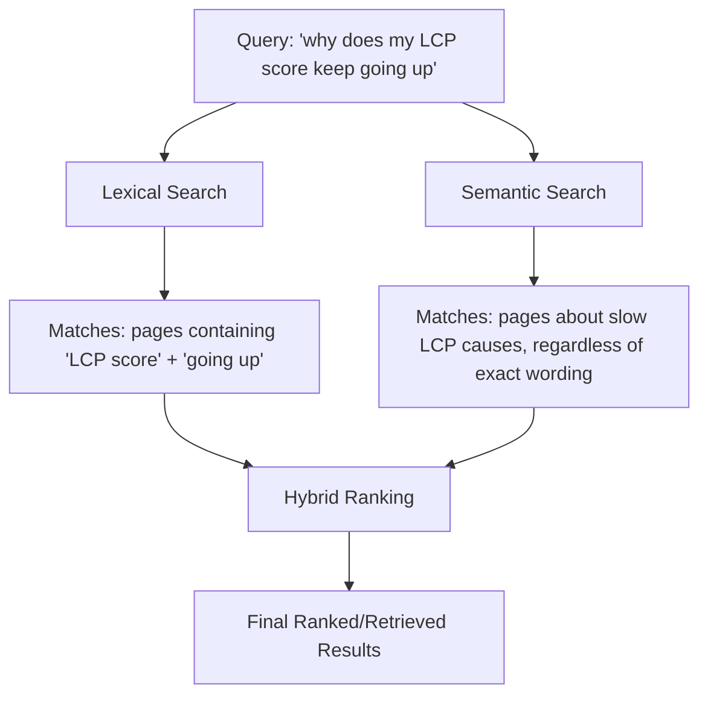

# Chapter 4: Semantic Search

**Version:** 1.0

---

# Table of Contents

1. Introduction
2. Lexical Search vs. Semantic Search
3. The Limits of Keyword Matching
4. How Semantic Search Understands Meaning
5. BERT and the Transformer Shift
6. Google's Use of Semantic Search
7. Semantic Search and Search Intent
8. Hybrid Search: Combining Lexical and Semantic
9. Implications for Content Writing
10. Diagram: Lexical vs. Semantic Matching
11. Best Practices
12. Common Mistakes
13. Checklist
14. Summary
15. References

---

# 1. Introduction

Semantic search matches queries to content based on meaning rather than exact keyword overlap. It is the technology that lets a search for "how to stop my phone screen from cracking" return content about phone cases and screen protectors, even without a single shared keyword between query and page. This chapter explains how semantic matching works and what it means for content strategy.

---

# 2. Lexical Search vs. Semantic Search

| Aspect | Lexical Search | Semantic Search |
|---|---|---|
| Matching basis | Exact/fuzzy keyword and term overlap | Meaning and conceptual similarity |
| Handles synonyms | Poorly, without explicit synonym lists | Natively — "purchase" and "buy" are understood as related |
| Handles paraphrasing | Poorly | Well — different phrasings of the same question match |
| Underlying representation | Inverted index of terms | Dense vector embeddings ([Chapter 5](chapter-05.md)) |

---

# 3. The Limits of Keyword Matching

Traditional lexical search (an inverted index mapping terms to documents) breaks down for natural, conversational queries: a user asking "why does my LCP score keep going up" and a page titled "Common Causes of Slow Largest Contentful Paint" share almost no exact keywords, yet are a near-perfect match in meaning. Pure keyword matching would rank this pairing poorly; semantic search ranks it highly.

---

# 4. How Semantic Search Understands Meaning

Semantic search systems convert both queries and documents into numerical vector representations (embeddings — covered fully in [Chapter 5](chapter-05.md)) that place semantically similar text near each other in a high-dimensional space, regardless of exact word choice. Matching then becomes a mathematical operation: finding document vectors closest to the query vector, rather than counting overlapping terms.

---

# 5. BERT and the Transformer Shift

Google's 2019 BERT update was a landmark moment in applying transformer-based language models to understand query context and nuance — particularly the relationships between words in a sentence (prepositions, negation, word order) that earlier keyword-based systems handled poorly. This shift toward transformer-based language understanding is the direct technical ancestor of the LLMs powering today's answer engines ([Chapter 8](chapter-08.md)).

---

# 6. Google's Use of Semantic Search

Google has layered semantic understanding throughout its ranking systems for years — synonym matching, query expansion, passage-level understanding, and the neural matching systems that underlie modern Search. Semantic search doesn't replace traditional relevance and authority signals ([SEO Book, Chapter 6](../seo/chapter-06.md)); it changes how the initial relevance match between query and content is computed.

---

# 7. Semantic Search and Search Intent

Semantic search is what makes true intent matching ([SEO Book, Chapter 7](../seo/chapter-07.md)) technically possible at scale: rather than requiring a page to contain the exact phrase a user searches, systems can recognize that a page's content satisfies the *underlying need* behind many different phrasings of a similar question.

---

# 8. Hybrid Search: Combining Lexical and Semantic

Most production search and retrieval systems — including the RAG pipelines behind answer engines ([AEO Book, Chapter 2](../aeo/chapter-02.md)) — use **hybrid search**, combining lexical (keyword/BM25-style) matching with semantic (vector) matching and blending the results. Lexical search remains strong for exact-match needs (product codes, proper nouns, precise phrases), while semantic search captures conceptual relevance that pure keyword matching misses. Neither alone is sufficient for high-quality retrieval.

---

# 9. Implications for Content Writing

- Write naturally and comprehensively around a topic rather than repeating exact-match keyword phrases
- Cover a topic's related concepts and common phrasings, since semantic matching rewards conceptual completeness
- Don't abandon exact terminology entirely — hybrid search still values precise terms for exact-match queries (product names, technical terms, model numbers)
- Focus on genuinely and thoroughly answering the underlying question, which is what both semantic ranking and citation-based answer engines ultimately reward

---

# 10. Diagram: Lexical vs. Semantic Matching

---

# 11. Best Practices

- Write comprehensively around a topic and its related concepts, not just target exact-match phrases
- Maintain precise terminology for exact-match needs (product names, technical specs) alongside natural language coverage
- Structure content to genuinely and thoroughly answer the underlying question a topic represents
- Understand that semantic and lexical matching work together, not as a choice between them

---

# 12. Common Mistakes

- Assuming semantic search means keyword relevance no longer matters at all
- Writing vague, generalized content that never states precise facts or terms clearly
- Ignoring related concepts and common phrasings a topic naturally includes
- Treating BERT-era updates as a one-time historical event rather than an ongoing architectural direction

---

# 13. Checklist

- [ ] Content covers a topic's related concepts, not just a single exact-match phrase
- [ ] Precise terminology retained where exact-match queries matter (product names, specs)
- [ ] Content genuinely and thoroughly answers the underlying question, not just surface keywords
- [ ] Writing style is natural and conversational, matching how real users phrase questions

---

# Summary

Semantic search matches content to queries based on meaning, represented mathematically through vector embeddings, rather than relying purely on exact keyword overlap. Most modern systems use hybrid search, combining lexical precision with semantic understanding. For content strategy, this means writing comprehensively and naturally around a topic's full conceptual scope while retaining precise terminology where exact matches matter.

---

# Learning Outcomes

After completing this chapter, you will understand:

- The difference between lexical and semantic search
- How transformer-based models like BERT changed query understanding
- Why hybrid search combines both approaches in production systems
- How to write content that performs well under semantic matching

---

# References

- Google: Understanding Searches Better Than Ever Before (BERT announcement)
- Devlin et al., "BERT: Pre-training of Deep Bidirectional Transformers for Language Understanding"

---

**Next:** Chapter 5 – Embeddings & Vector Representations
