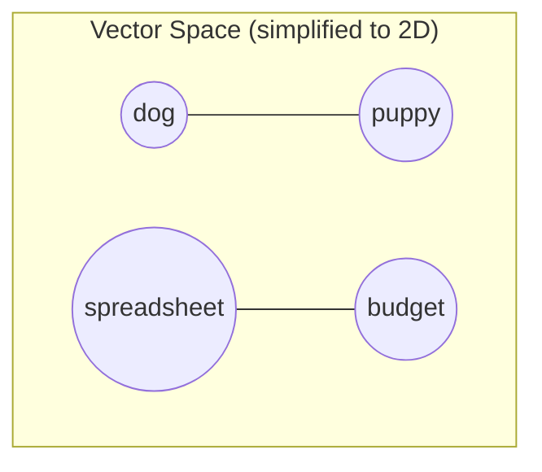

# Chapter 5: Embeddings & Vector Representations

**Version:** 1.0

---

# Table of Contents

1. Introduction
2. What is an Embedding?
3. From Words to Sentences to Passages
4. How Embedding Models Are Trained
5. Embedding Dimensionality
6. Cosine Similarity and Distance Metrics
7. Popular Embedding Models
8. Embeddings in the Retrieval Pipeline
9. Visualizing Embedding Space
10. Diagram: Embedding and Similarity
11. Best Practices
12. Common Mistakes
13. Checklist
14. Summary
15. References

---

# 1. Introduction

An embedding is a numerical representation of text (a word, sentence, or passage) as a vector — a list of numbers — positioned in a high-dimensional space such that semantically similar text ends up positioned close together. Embeddings are the mathematical foundation that makes semantic search ([Chapter 4](chapter-04.md)) and retrieval-augmented generation ([Chapter 7](chapter-07.md)) possible.

---

# 2. What is an Embedding?

Conceptually, an embedding model learns to map text into a coordinate system where distance corresponds to meaning: "dog" and "puppy" end up near each other, while "dog" and "spreadsheet" end up far apart. A simplified example with just 3 dimensions:

| Text | Dimension 1 | Dimension 2 | Dimension 3 |
|---|---|---|---|
| "dog" | 0.82 | 0.15 | 0.44 |
| "puppy" | 0.79 | 0.18 | 0.41 |
| "spreadsheet" | 0.02 | 0.91 | 0.08 |

Real embedding models use hundreds to thousands of dimensions, and the individual dimensions are not human-interpretable the way this simplified example implies — meaning emerges from the overall geometry, not any single dimension.

---

# 3. From Words to Sentences to Passages

Early embedding techniques (word2vec, GloVe) produced a single vector per word. Modern embedding models, built on transformer architectures, produce embeddings for entire sentences or passages, capturing context-dependent meaning — the same word can contribute differently to a sentence's embedding depending on surrounding context, unlike static word-level vectors. This passage-level embedding is what retrieval systems actually index and search against, directly connecting to the passage-level chunking discussed in [AEO Book, Chapter 2, Section 6](../aeo/chapter-02.md).

---

# 4. How Embedding Models Are Trained

Embedding models are typically trained on large volumes of text using self-supervised objectives (predicting masked words, or distinguishing genuinely related text pairs from random pairs) that push semantically related text closer together in vector space and unrelated text farther apart. Some models are further fine-tuned specifically for retrieval tasks, optimizing directly for the property that a query and its correct matching passage should be close in the resulting vector space.

---

# 5. Embedding Dimensionality

Embedding models produce vectors of a fixed length (dimensionality) — common sizes range from a few hundred to several thousand dimensions. Higher dimensionality can capture more nuance but costs more to store and search; production systems balance retrieval quality against storage and latency, and many modern embedding models offer variable-dimension outputs (via techniques like Matryoshka embeddings) to make this trade-off tunable.

---

# 6. Cosine Similarity and Distance Metrics

The most common way to measure similarity between two embeddings is **cosine similarity** — the cosine of the angle between two vectors, ranging from -1 (opposite meaning) to 1 (identical meaning), with values near 0 indicating unrelated content. Other distance metrics (Euclidean/L2 distance, dot product) are also used depending on the embedding model and vector database, but cosine similarity is the most widely adopted default for text embeddings.

---

# 7. Popular Embedding Models

| Model Family | Provider | Notes |
|---|---|---|
| OpenAI text-embedding-3 | OpenAI | Widely used in commercial RAG applications |
| Sentence-BERT (SBERT) | Open source | Foundational sentence-embedding architecture |
| Cohere Embed | Cohere | Multilingual, retrieval-optimized |
| Open-source models (e.g., BGE, GTE, E5 families) | Various | Self-hostable alternatives with strong benchmark performance |

Model choice affects retrieval quality, cost, and latency — this is an active, fast-moving area, and current benchmark leaderboards (e.g., MTEB) are a better source of up-to-date comparisons than any static list.

---

# 8. Embeddings in the Retrieval Pipeline

Both content and queries must be embedded using the *same* model (or compatible models) for similarity comparisons to be meaningful — this is why retrieval systems are tightly coupled to a specific embedding model choice.

---

# 9. Visualizing Embedding Space

Because raw embeddings have hundreds or thousands of dimensions, they are typically visualized using dimensionality-reduction techniques (t-SNE, UMAP) that project them down to 2 or 3 dimensions for human inspection — useful for auditing whether a content library's embeddings cluster sensibly by topic, revealing gaps or unexpected overlaps between supposedly distinct topics.

---

# 10. Diagram: Embedding and Similarity

Points positioned close together (dog/puppy) represent high similarity; distant clusters (spreadsheet/budget vs. dog/puppy) represent unrelated concepts.

---

# 11. Best Practices

- Understand that embeddings capture meaning, not exact word overlap — write for conceptual clarity, not keyword density
- When building internal RAG/search tools, use the same embedding model consistently for both indexing and querying
- Periodically audit content embeddings for unexpected topic clustering or gaps using dimensionality-reduction visualization
- Track embedding model benchmarks (e.g., MTEB) when evaluating or building retrieval systems, as this space evolves quickly

---

# 12. Common Mistakes

- Mixing embeddings from different models in the same vector index (similarity scores become meaningless)
- Assuming embedding-based retrieval eliminates the need for precise terminology entirely
- Treating embedding dimensionality as simply "more is always better" without considering cost/latency trade-offs
- Never re-evaluating embedding model choice as newer, better-performing models are released

---

# 13. Checklist

- [ ] Understand embeddings represent meaning as vectors in high-dimensional space
- [ ] Know that content and queries must use the same/compatible embedding model
- [ ] Aware of cosine similarity as the standard comparison metric
- [ ] Current embedding model choice checked against up-to-date benchmarks if building retrieval systems

---

# Summary

Embeddings convert text into numerical vectors positioned so that semantically similar content clusters together in high-dimensional space, measured via cosine similarity or related distance metrics. This mathematical representation of meaning is the foundation of semantic search, vector retrieval ([Chapter 6](chapter-06.md)), and retrieval-augmented generation ([Chapter 7](chapter-07.md)) — the machinery that ultimately determines which passages an AI answer engine retrieves and cites.

---

# Learning Outcomes

After completing this chapter, you will understand:

- What an embedding is and how it represents meaning as a vector
- How embedding models are trained and how dimensionality affects trade-offs
- How cosine similarity measures relatedness between embeddings
- How embeddings function within a full retrieval pipeline

---

# References

- Reimers & Gurevych, ["Sentence-BERT: Sentence Embeddings using Siamese BERT-Networks"](https://arxiv.org/abs/1908.10084)
- Muennighoff et al., ["MTEB: Massive Text Embedding Benchmark"](https://arxiv.org/abs/2210.07316)

---

**Next:** Chapter 6 – Vector Search & Retrieval
