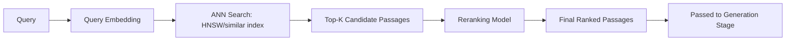

# Chapter 6: Vector Search & Retrieval

**Version:** 1.0

---

# Table of Contents

1. Introduction
2. What is Vector Search?
3. The Nearest Neighbor Problem
4. Approximate Nearest Neighbor Algorithms
5. HNSW: A Common ANN Approach
6. Vector Databases
7. Indexing Content for Vector Search
8. Retrieval Quality: Recall, Precision, and Top-K
9. Reranking
10. Diagram: Vector Search Pipeline
11. Best Practices
12. Common Mistakes
13. Checklist
14. Summary
15. References

---

# 1. Introduction

Vector search is the process of finding the stored embeddings ([Chapter 5](chapter-05.md)) most similar to a query embedding, at scale — often across millions or billions of vectors, in milliseconds. This chapter covers how that search is actually performed and how content should be indexed to support it well.

---

# 2. What is Vector Search?

Given a query vector, vector search finds the *k* closest vectors in a stored collection (the "top-K nearest neighbors"), using a similarity metric such as cosine similarity ([Chapter 5, Section 6](chapter-05.md)). Those top-K results represent the passages judged most semantically relevant to the query — the direct input to the ranking and generation stages of the RAG pipeline ([AEO Book, Chapter 2](../aeo/chapter-02.md)).

---

# 3. The Nearest Neighbor Problem

Computing exact nearest neighbors — comparing a query vector against every single stored vector — is computationally expensive at scale: comparing against a million passages for every query becomes a bottleneck well before reaching web-scale content volumes. This is the core problem vector search infrastructure exists to solve efficiently.

---

# 4. Approximate Nearest Neighbor Algorithms

Approximate Nearest Neighbor (ANN) algorithms trade a small amount of accuracy for large gains in search speed, making large-scale vector search practical. Rather than comparing against every stored vector, ANN algorithms organize vectors into data structures (graphs, trees, hashed buckets) that let a search quickly narrow to a small, likely-relevant subset.

---

# 5. HNSW: A Common ANN Approach

Hierarchical Navigable Small World (HNSW) is one of the most widely used ANN algorithms in production vector databases. It builds a multi-layered graph structure where each vector is a node, connected to its approximate neighbors, with sparser "highway" layers on top for fast traversal to the right neighborhood before descending into denser layers for precise results — conceptually similar to how a hierarchical road network lets you get from highway to local street efficiently rather than searching every street exhaustively.

---

# 6. Vector Databases

| System | Type | Notes |
|---|---|---|
| Pinecone | Managed vector database | Fully managed, purpose-built for vector search |
| Weaviate | Open-source / managed | Combines vector and hybrid search |
| Qdrant | Open-source / managed | Rust-based, strong hybrid search support |
| pgvector | PostgreSQL extension | Adds vector search to an existing relational database |
| Elasticsearch/OpenSearch (vector fields) | Search engine with vector support | Combines traditional lexical and vector search natively |

Choice of vector database depends on scale, existing infrastructure, and whether hybrid lexical+semantic search ([Chapter 4, Section 8](chapter-04.md)) is required alongside pure vector search.

---

# 7. Indexing Content for Vector Search

Preparing content for vector search involves the same chunking considerations covered in [AEO Book, Chapter 2, Section 6](../aeo/chapter-02.md): splitting content into passages of an appropriate size, generating an embedding per chunk, and storing each chunk's embedding alongside metadata (source URL, section heading, publish date) needed to reconstruct context and attribution at retrieval time.

---

# 8. Retrieval Quality: Recall, Precision, and Top-K

| Metric | Meaning |
|---|---|
| Recall | Of all truly relevant passages, how many did the search return? |
| Precision | Of all passages returned, how many were actually relevant? |
| Top-K | How many results are retrieved before ranking/generation |

ANN algorithms are tuned to balance recall against search speed — too aggressive an approximation can miss genuinely relevant passages (lower recall), while an overly exhaustive search sacrifices the latency benefits ANN exists to provide.

---

# 9. Reranking

Many production retrieval pipelines add a **reranking** stage after initial vector search: a smaller, more precise (and more computationally expensive) model re-scores the top-K candidates returned by the fast ANN search, improving final relevance ordering before passages are passed to generation. This two-stage pattern — fast approximate retrieval followed by precise reranking — is common across modern RAG systems and directly affects which passages ultimately get cited in an answer engine's response.

---

# 10. Diagram: Vector Search Pipeline

---

# 11. Best Practices

- Chunk content thoughtfully before indexing — chunk size directly affects retrieval quality
- Store rich metadata (URL, heading, date, author) alongside each embedded chunk for attribution
- Consider hybrid lexical+vector search rather than pure vector search for production systems
- Add a reranking stage when precision matters more than raw retrieval speed allows

---

# 12. Common Mistakes

- Treating vector search as a black box without understanding the recall/speed trade-off it makes
- Indexing overly large or overly small chunks without testing retrieval quality empirically
- Omitting metadata needed to attribute and cite retrieved passages correctly
- Skipping reranking entirely in systems where citation precision matters

---

# 13. Checklist

- [ ] Content chunked at an appropriate, tested size before embedding
- [ ] Metadata stored alongside each embedded chunk for attribution
- [ ] Hybrid search evaluated as an option, not just pure vector search
- [ ] Reranking considered for precision-sensitive retrieval use cases

---

# Summary

Vector search finds the closest matching embeddings to a query using approximate nearest neighbor algorithms like HNSW, trading a small amount of accuracy for the speed required at web scale. Thoughtful content chunking, rich metadata, hybrid lexical+vector search, and an optional reranking stage all directly affect which passages ultimately surface in an AI-generated, cited answer.

---

# Learning Outcomes

After completing this chapter, you will understand:

- What vector search does and why exact nearest-neighbor search doesn't scale
- How approximate nearest neighbor algorithms like HNSW work conceptually
- The landscape of vector database options
- How reranking improves retrieval precision in production RAG systems

---

# References

- Malkov & Yashunin, ["Efficient and Robust Approximate Nearest Neighbor Search Using Hierarchical Navigable Small World Graphs"](https://arxiv.org/abs/1603.09320)
- Vector database documentation: [Pinecone](https://docs.pinecone.io/), [Weaviate](https://docs.weaviate.io/), [Qdrant](https://qdrant.tech/documentation/)

---

**Next:** Chapter 7 – Retrieval-Augmented Generation (RAG)
