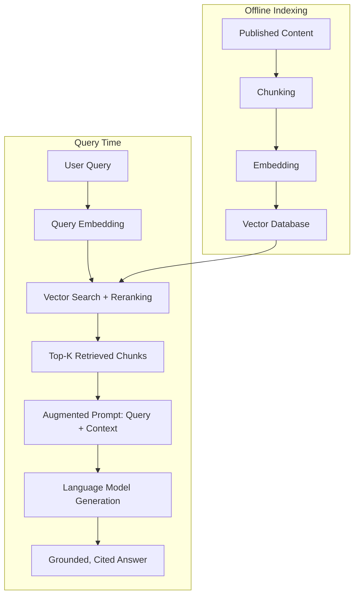

# Chapter 7: Retrieval-Augmented Generation (RAG)

**Version:** 1.0

---

# Table of Contents

1. Introduction
2. Why RAG Exists
3. The RAG Architecture, Revisited
4. Parametric vs. Non-Parametric Knowledge
5. Grounding and Hallucination Reduction
6. Context Window Constraints
7. Multi-Hop and Agentic RAG
8. RAG Failure Modes
9. RAG as the Bridge Between Content and Answer Engines
10. Diagram: Full RAG Architecture
11. Best Practices
12. Common Mistakes
13. Checklist
14. Summary
15. References

---

# 1. Introduction

Retrieval-Augmented Generation (RAG) combines a retrieval system — the vector search machinery from [Chapter 6](chapter-06.md) — with a generative language model, grounding the model's output in retrieved, real content rather than relying solely on what it learned during training. RAG is the architectural pattern behind nearly every answer engine covered in the [AEO Book](../aeo/README.md), and this chapter examines it in depth as the final piece connecting content, retrieval, and generated answers.

---

# 2. Why RAG Exists

Language models have two fundamental limitations RAG addresses: their training data has a knowledge cutoff (they don't know about events or content published after training), and they can **hallucinate** — generate plausible-sounding but false information, particularly for specific facts, recent events, or long-tail topics underrepresented in training data. RAG mitigates both by grounding generation in retrieved, current, verifiable source documents at the moment of answering.

---

# 3. The RAG Architecture, Revisited

Building on the pipeline introduced in [AEO Book, Chapter 2](../aeo/chapter-02.md), the RAG architecture in full technical detail:

1. **Indexing (offline, ongoing)**: content is chunked, embedded ([Chapter 5](chapter-05.md)), and stored in a vector database ([Chapter 6](chapter-06.md))
2. **Query processing (per request)**: the user's query is embedded using the same model
3. **Retrieval**: vector search (optionally hybrid, optionally reranked) returns the top-K most relevant chunks
4. **Augmentation**: retrieved chunks are inserted into the language model's prompt/context, alongside the original query
5. **Generation**: the model generates a response conditioned on both the query and the retrieved context
6. **Citation** (where supported): the response links specific claims back to their source chunks

---

# 4. Parametric vs. Non-Parametric Knowledge

| Knowledge Type | Source | Characteristics |
|---|---|---|
| Parametric | Learned during model training, encoded in model weights | Fixed at training time, can be outdated, can be hallucinated |
| Non-parametric (retrieved) | Fetched at query time from an external source | Current, verifiable, directly citable, but limited by retrieval quality |

RAG systems blend both: the model's parametric knowledge provides general language understanding and reasoning ability, while retrieved non-parametric knowledge provides the specific, current, and citable facts a good answer requires.

---

# 5. Grounding and Hallucination Reduction

"Grounding" means constraining a model's output to be consistent with retrieved source material rather than freely generating from parametric knowledge alone. Well-designed RAG systems instruct the model (via its system prompt) to answer *only* from the retrieved context and to indicate when the retrieved context doesn't contain a sufficient answer — reducing, though not eliminating, hallucination risk. This is why the citability practices in [AEO Book, Chapter 7](../aeo/chapter-07.md) matter mechanically: clear, unambiguous retrieved passages are easier for a model to ground an accurate answer in.

---

# 6. Context Window Constraints

Language models can only accept a finite amount of text in a single request (the context window). This constrains how many retrieved chunks can realistically be included, which is why retrieval and reranking ([Chapter 6, Section 9](chapter-06.md)) must prioritize the *most* relevant passages rather than including everything even remotely related — an oversized, noisy context can degrade generation quality just as much as an insufficient one.

---

# 7. Multi-Hop and Agentic RAG

More advanced RAG systems perform **multi-hop retrieval**: issuing an initial retrieval, using its results to formulate a refined follow-up query, and repeating — useful for complex questions that a single retrieval pass can't fully answer. **Agentic RAG** extends this further, letting the model autonomously decide when and what to search for, potentially calling multiple tools (web search, internal databases, calculators) across several steps before generating a final answer — the pattern behind Perplexity's Deep Research mode and similar features ([AEO Book, Chapter 5, Section 5](../aeo/chapter-05.md)).

---

# 8. RAG Failure Modes

| Failure Mode | Cause | Effect |
|---|---|---|
| Retrieval miss | Relevant content not indexed, poorly chunked, or blocked from crawling | Model answers from parametric knowledge only, or admits it can't find an answer |
| Irrelevant retrieval | Poor embedding match or noisy index | Model grounds an answer in the wrong source, producing an inaccurate response |
| Context overflow | Too many/too-long chunks retrieved | Important passages diluted or truncated, degrading answer quality |
| Grounding failure | Model ignores retrieved context, relies on parametric knowledge anyway | Hallucination despite technically correct retrieval |

Understanding these failure modes explains why a page can be perfectly optimized under AEO tactics and still fail to be cited — the failure can occur at any stage of this pipeline, not just at the content level.

---

# 9. RAG as the Bridge Between Content and Answer Engines

RAG is the mechanism that ultimately determines the answer to the question this entire book series has been building toward: given a piece of published content, will it be retrieved, will it be selected as evidence, and will it shape a generated, cited answer? Every practice in the [SEO Book](../seo/README.md) (crawlability, indexability) and [AEO Book](../aeo/README.md) (citability, platform-specific tactics) exists to improve a page's odds at one or more stages of this exact pipeline.

---

# 10. Diagram: Full RAG Architecture

---

# 11. Best Practices

- Ensure content is crawlable, well-chunked, and embedded — a retrieval miss defeats every downstream optimization
- Write clear, unambiguous passages that are easy for a model to ground answers in accurately
- Understand that multi-hop and agentic RAG reward comprehensive, well-organized long-form content
- Recognize that RAG failures can occur at any pipeline stage, not just at the content-quality level, when diagnosing why content isn't being cited

---

# 12. Common Mistakes

- Assuming a citation failure is always a content-quality problem, when it may be a retrieval or crawling issue
- Writing content so long or unfocused that context-window constraints dilute its most important facts
- Ignoring that agentic/multi-hop RAG rewards different content shapes than single-pass retrieval
- Treating RAG as a black box rather than a diagnosable pipeline with distinct failure modes

---

# 13. Checklist

- [ ] Content confirmed crawlable and indexable as a prerequisite to any RAG optimization
- [ ] Chunking and passage clarity reviewed per [Chapter 6](chapter-06.md) and [AEO Book, Chapter 7](../aeo/chapter-07.md)
- [ ] Long-form content organized to support multi-hop/agentic retrieval, not just single-pass queries
- [ ] Citation failures diagnosed against the specific pipeline stage likely responsible

---

# Summary

Retrieval-Augmented Generation grounds language model output in retrieved, current content, mitigating knowledge-cutoff and hallucination limitations. Its architecture — indexing, retrieval, augmentation, generation, and citation — is the final mechanical bridge connecting every SEO and AEO practice in this book series to whether a specific piece of content actually shapes an AI-generated, cited answer.

---

# Learning Outcomes

After completing this chapter, you will understand:

- Why RAG exists and what limitations of language models it addresses
- The full RAG architecture from indexing through citation
- The difference between parametric and retrieved (non-parametric) knowledge
- Common RAG failure modes and how to diagnose them

---

# References

- Lewis et al., "Retrieval-Augmented Generation for Knowledge-Intensive NLP Tasks"
- Gao et al., "Retrieval-Augmented Generation for Large Language Models: A Survey"

---

**Next:** Chapter 8 – How LLMs Generate Answers & GEO Strategy
