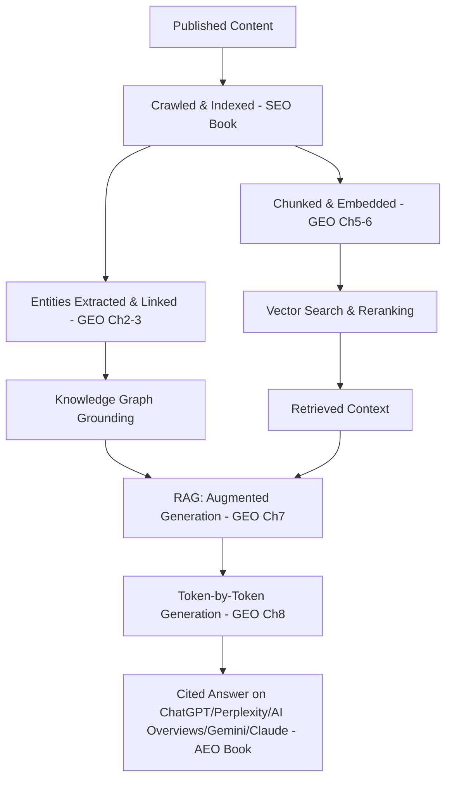

# Chapter 8: How LLMs Generate Answers & GEO Strategy

**Version:** 1.0

---

# Table of Contents

1. Introduction
2. How Large Language Models Generate Text
3. Tokens and Next-Token Prediction
4. Why Grounding and Structure Both Matter
5. Putting the Full Stack Together
6. A GEO-Informed Content Checklist
7. Where GEO Is Heading
8. Diagram: The Complete Content-to-Answer Pipeline
9. Best Practices
10. Common Mistakes
11. Checklist
12. Summary
13. Book Summary: Putting the Whole Series Together
14. References

---

# 1. Introduction

This closing chapter completes the technical picture by covering how large language models actually generate text, then ties every concept from this book — and its companion SEO and AEO volumes — into a single, coherent GEO strategy.

---

# 2. How Large Language Models Generate Text

A large language model generates text one token at a time, predicting the most probable next token given everything that came before it (the prompt, retrieved context, and previously generated tokens), then repeating this process — sampling a next token, appending it, and predicting again — until the response is complete. This is a fundamentally different process from a database lookup: the model isn't retrieving a stored answer, it is generating a novel sequence of tokens statistically likely to constitute a good response given its training and, in a RAG setting, its retrieved context ([Chapter 7](chapter-07.md)).

---

# 3. Tokens and Next-Token Prediction

Text is broken into **tokens** — subword units that may be whole words, parts of words, or punctuation — before being processed by the model. Understanding tokens matters practically: the length limits discussed as "context window constraints" ([Chapter 7, Section 6](chapter-07.md)) are measured in tokens, not words or characters, and different languages/scripts tokenize with different efficiency, affecting how much content actually fits in a given context budget.

---

# 4. Why Grounding and Structure Both Matter

Because generation is fundamentally probabilistic next-token prediction, two things matter enormously for producing an accurate, well-attributed answer:

- **Grounding** ([Chapter 7, Section 5](chapter-07.md)) constrains what the model has available to generate from, reducing the chance it falls back on potentially outdated or hallucinated parametric knowledge
- **Structure** (clear passages, explicit facts, unambiguous phrasing — [AEO Book, Chapter 7](../aeo/chapter-07.md)) makes it more likely the model's token-by-token generation process accurately reflects the source material rather than subtly drifting from it during generation

Neither retrieval quality nor content clarity alone is sufficient — both must work together across the full pipeline.

---

# 5. Putting the Full Stack Together

| Layer | Concept | Chapter |
|---|---|---|
| Content representation | Entities, knowledge graphs | [Ch. 2-3](chapter-02.md) |
| Meaning matching | Semantic search, embeddings | [Ch. 4-5](chapter-04.md) |
| Retrieval at scale | Vector search, ANN, reranking | [Ch. 6](chapter-06.md) |
| Grounded synthesis | RAG architecture | [Ch. 7](chapter-07.md) |
| Final output | Token-by-token generation | This chapter |

Each layer depends on the ones beneath it: generation quality depends on grounding, grounding depends on retrieval quality, retrieval depends on good embeddings and indexing, and all of it depends on content being well-represented as entities and clear semantic meaning in the first place.

---

# 6. A GEO-Informed Content Checklist

Distilling the entire GEO Book into a single practical checklist for any important piece of content:

- [ ] Entities are named explicitly, consistently, and with high salience ([Ch. 3](chapter-03.md))
- [ ] Structured data reinforces entity and factual claims ([SEO Book, Ch. 14](../seo/chapter-14.md))
- [ ] Content is written comprehensively around a topic's full semantic scope, not just exact-match phrases ([Ch. 4](chapter-04.md))
- [ ] Passages are chunked logically and remain self-contained ([Ch. 6](chapter-06.md), [AEO Book, Ch. 7](../aeo/chapter-07.md))
- [ ] The site is crawlable and accessible to AI crawlers, so retrieval is even possible ([AEO Book, Ch. 8](../aeo/chapter-08.md))
- [ ] Facts are stated directly and specifically, supporting accurate grounding ([Ch. 7](chapter-07.md))

---

# 7. Where GEO Is Heading

The specific platforms in the AEO Book will change faster than the underlying mechanisms in this book. New answer engines will emerge, embedding models will improve, and retrieval architectures will grow more sophisticated (deeper agentic and multi-hop patterns, larger context windows, better reranking). The durable investment is in the mechanisms this book covers: well-represented entities, semantically comprehensive content, clean chunking, and grounding-friendly clarity — practices that remain valuable regardless of which specific platform or model architecture wins next.

---

# 8. Diagram: The Complete Content-to-Answer Pipeline

---

# 9. Best Practices

- Treat SEO, AEO, and GEO as one continuous pipeline, not three separate disciplines competing for priority
- Invest in the durable mechanisms (entities, semantic clarity, chunking, grounding) over platform-specific tricks that may not transfer
- Revisit platform-specific AEO tactics periodically as models and platforms evolve, while keeping GEO fundamentals stable
- Diagnose citation failures against the specific pipeline layer likely responsible, using the full stack in Section 5

---

# 10. Common Mistakes

- Treating SEO, AEO, and GEO as competing priorities rather than layers of one pipeline
- Chasing platform-specific tricks without understanding the underlying mechanism that makes them work
- Assuming today's best-performing content structures are permanent rather than tied to current model/retrieval architectures
- Giving up on AEO/GEO investment because measurement is harder than traditional SEO ([AEO Book, Chapter 10](../aeo/chapter-10.md))

---

# 11. Checklist

- [ ] SEO, AEO, and GEO treated as one integrated content strategy
- [ ] Durable GEO mechanisms (entities, semantics, chunking, grounding) prioritized over one-off platform tricks
- [ ] Content reviewed periodically as platforms and models evolve
- [ ] Citation/visibility failures diagnosed against the specific pipeline layer responsible

---

# Summary

Large language models generate answers through probabilistic, token-by-token prediction, conditioned on retrieved context in a RAG system. Producing accurate, well-attributed answers depends on both grounding (quality retrieval) and structure (clear, unambiguous content) working together across the full stack this book has covered: entities and knowledge graphs, semantic search and embeddings, vector retrieval, and retrieval-augmented generation.

---

# Book Summary: Putting the Whole Series Together

Across three books, this series has covered the full arc from foundational web visibility to the deepest technical mechanisms behind AI-generated answers:

- **The [SEO Book](../seo/README.md)** established the foundation: crawling, indexing, ranking, content quality, technical performance, and measurement — the prerequisite for any content to be found at all.
- **The [AEO Book](../aeo/README.md)** extended that foundation into the world of AI answer engines: platform-specific tactics for ChatGPT, Google AI Overviews, Perplexity, Gemini, and Claude, passage-level citability, crawler accessibility, and AI visibility measurement.
- **This GEO Book** went one layer deeper, explaining the actual technology — knowledge graphs, entities, semantic search, embeddings, vector retrieval, and retrieval-augmented generation — that makes every AEO tactic work mechanically, and that will keep working as specific platforms rise, change, and are replaced.

Together, these three books form a complete, durable framework for building content strategy in a world where search results are increasingly synthesized answers rather than ranked lists of links.

---

# Learning Outcomes

After completing this chapter, you will understand:

- How large language models generate text through token-by-token prediction
- Why grounding and content structure are complementary, not interchangeable, requirements
- How every concept across the SEO, AEO, and GEO books fits into one integrated pipeline
- How to build a durable content strategy that survives platform and model change

---

# References

- Vaswani et al., "Attention Is All You Need" (the transformer architecture underlying modern LLMs)
- This book series in full: the [SEO Book](../seo/README.md), the [AEO Book](../aeo/README.md), and this GEO Book

---

**This concludes the GEO Book and the full SEO/AEO/GEO series.**
