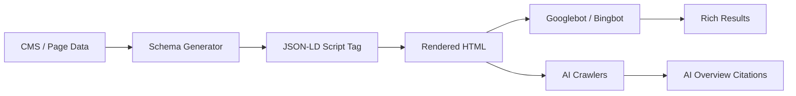
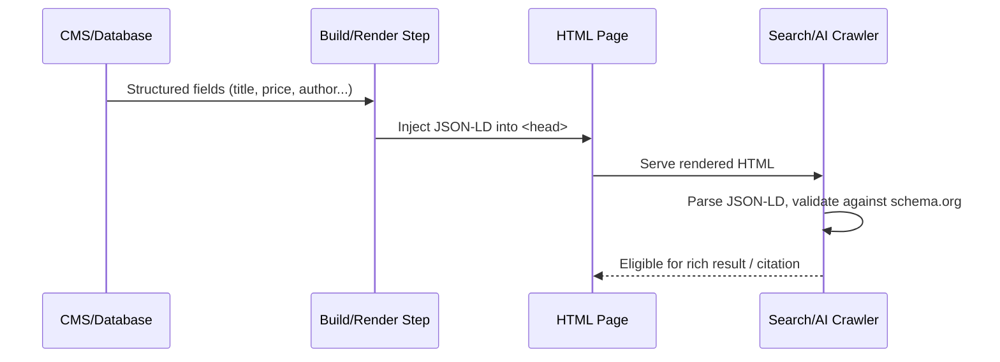

# Chapter 14: Structured Data & Schema Markup

**Version:** 1.0

---

# Table of Contents

1. Introduction
2. What is Structured Data?
3. Why Schema Markup Matters for SEO and AI Search
4. JSON-LD vs. Microdata vs. RDFa
5. Schema.org Vocabulary
6. Core Schema Types
7. Article Schema
8. Product Schema
9. FAQ Schema
10. HowTo Schema
11. LocalBusiness Schema
12. Organization Schema
13. BreadcrumbList Schema
14. Review and AggregateRating Schema
15. Video Schema
16. Nested and Combined Schema
17. Schema for AI Overviews and LLM Citations
18. Validation Tools
19. Common Implementation Patterns
20. Diagram: Schema Rendering Pipeline
21. Best Practices
22. Common Mistakes
23. Implementation Checklist
24. Summary
25. References

---

# 1. Introduction

Structured data is machine-readable markup added to a web page's HTML that describes its content in a standardized vocabulary. It does not change what a visitor sees — it changes what search engines and AI systems *understand*. Where a human reads "4.8 stars, 230 reviews" in a paragraph, structured data states explicitly: `AggregateRating.ratingValue = 4.8`, `AggregateRating.reviewCount = 230`.

This chapter covers the practical implementation of Schema.org markup: which types matter most, how to write valid JSON-LD, how to avoid the mistakes that trigger manual actions, and how structured data has become a prerequisite for citation in AI Overviews, ChatGPT search, and Perplexity — the subject of the AEO and GEO books later in this series.

---

# 2. What is Structured Data?

Structured data is a standardized format for providing information about a page and classifying its content. Search engines use it to:

- Understand entities (people, places, products, organizations) unambiguously
- Generate rich results (star ratings, FAQ dropdowns, breadcrumbs, product pricing)
- Build and enrich their Knowledge Graph
- Feed extractive answers into AI Overviews and chat-based assistants

Structured data does not guarantee a ranking boost or a rich result — it removes ambiguity so eligible content *can* be selected for enhanced display.

---

# 3. Why Schema Markup Matters for SEO and AI Search

| Benefit | Traditional SEO | AI Search (AEO/GEO) |
|---|---|---|
| Rich results | Star ratings, sitelinks, FAQ dropdowns | N/A |
| Click-through rate | Higher CTR from visual differentiation | N/A |
| Entity disambiguation | Helps Knowledge Graph matching | Critical for LLM entity grounding |
| Extractive answers | N/A | Schema fields are prime source material for AI Overviews |
| Citation likelihood | N/A | Structured facts are easier for LLMs to quote accurately |

Google, Bing, and AI answer engines all prefer content where facts (price, author, date, rating, steps) are explicit and structured rather than buried in prose.

---

# 4. JSON-LD vs. Microdata vs. RDFa

| Format | Location | Readability | Google Recommendation |
|---|---|---|---|
| JSON-LD | `<script type="application/ld+json">` in `<head>` or `<body>` | High — separate from HTML | **Recommended** |
| Microdata | Inline HTML attributes (`itemscope`, `itemprop`) | Low — clutters markup | Supported, not preferred |
| RDFa | Inline HTML attributes (`vocab`, `typeof`, `property`) | Low | Supported, not preferred |

JSON-LD is the industry standard because it can be generated and injected independently of the visible HTML, making it easy to template and automate at scale — see `scripts/schema_generator.py` in this repository.

---

# 5. Schema.org Vocabulary

Schema.org is a collaborative vocabulary maintained by Google, Microsoft, Yahoo, and Yandex. It defines thousands of types (`Thing` → `CreativeWork` → `Article`, `Thing` → `Product`, etc.) in a hierarchy. Search engines only actively consume a documented subset for rich results — always check the target engine's own documentation (e.g., Google Search Central's Structured Data Gallery) before relying on a niche type.

---

# 6. Core Schema Types

The types most SEO practitioners implement, in priority order:

1. `Organization` / `WebSite` — sitewide identity, sitelinks search box
2. `BreadcrumbList` — navigation path in SERPs
3. `Article` / `NewsArticle` / `BlogPosting` — content pages
4. `Product` / `Offer` / `AggregateRating` — e-commerce
5. `FAQPage` — question/answer pairs
6. `HowTo` — step-by-step instructions
7. `LocalBusiness` — physical/service-area businesses
8. `Review` — individual reviews

---

# 7. Article Schema

```json
{
  "@context": "https://schema.org",
  "@type": "Article",
  "headline": "Core Web Vitals: A Complete Guide",
  "author": {
    "@type": "Person",
    "name": "Jane Doe",
    "url": "https://example.com/authors/jane-doe"
  },
  "datePublished": "2026-01-15",
  "dateModified": "2026-06-01",
  "image": "https://example.com/images/cwv-guide.jpg",
  "publisher": {
    "@type": "Organization",
    "name": "Example Corp",
    "logo": {
      "@type": "ImageObject",
      "url": "https://example.com/logo.png"
    }
  }
}
```

`author` and `datePublished`/`dateModified` are the two fields most tied to E-E-A-T evaluation (see [Chapter 12](chapter-12.md)) — never omit them.

---

# 8. Product Schema

```json
{
  "@context": "https://schema.org",
  "@type": "Product",
  "name": "Trail Running Shoe",
  "sku": "TRS-2026-42",
  "brand": { "@type": "Brand", "name": "TrailCo" },
  "offers": {
    "@type": "Offer",
    "priceCurrency": "USD",
    "price": "129.99",
    "availability": "https://schema.org/InStock"
  },
  "aggregateRating": {
    "@type": "AggregateRating",
    "ratingValue": "4.7",
    "reviewCount": "182"
  }
}
```

`price`, `availability`, and `aggregateRating` are the fields Google requires for the product rich snippet — missing or stale values can suppress the entire rich result.

---

# 9. FAQ Schema

```json
{
  "@context": "https://schema.org",
  "@type": "FAQPage",
  "mainEntity": [
    {
      "@type": "Question",
      "name": "What is the ideal LCP score?",
      "acceptedAnswer": {
        "@type": "Answer",
        "text": "Largest Contentful Paint should be 2.5 seconds or less for a 'Good' rating."
      }
    }
  ]
}
```

FAQ schema is one of the highest-leverage types for AEO: its question/answer structure maps almost directly onto how AI Overviews and chat assistants extract and cite content. Only mark up FAQs that are genuinely visible on the page — Google has actively restricted eligibility for spammy, hidden FAQ markup.

---

# 10. HowTo Schema

```json
{
  "@context": "https://schema.org",
  "@type": "HowTo",
  "name": "How to Fix Cumulative Layout Shift",
  "step": [
    { "@type": "HowToStep", "text": "Set explicit width and height on images." },
    { "@type": "HowToStep", "text": "Reserve space for ads and embeds." },
    { "@type": "HowToStep", "text": "Avoid inserting content above existing content." }
  ]
}
```

---

# 11. LocalBusiness Schema

```json
{
  "@context": "https://schema.org",
  "@type": "LocalBusiness",
  "name": "Example Dental Clinic",
  "address": {
    "@type": "PostalAddress",
    "streetAddress": "123 Main St",
    "addressLocality": "Austin",
    "addressRegion": "TX",
    "postalCode": "78701",
    "addressCountry": "US"
  },
  "telephone": "+1-512-555-0100",
  "openingHoursSpecification": [
    { "@type": "OpeningHoursSpecification", "dayOfWeek": "Monday", "opens": "09:00", "closes": "17:00" }
  ]
}
```

`LocalBusiness` (and its ~50 subtypes such as `Dentist`, `Restaurant`, `Plumber`) must have NAP (Name, Address, Phone) data that exactly matches Google Business Profile — mismatches undermine local ranking signals.

---

# 12. Organization Schema

Sitewide `Organization` markup (on the homepage, referenced elsewhere) establishes the brand entity for the Knowledge Graph and enables `sameAs` links to authoritative profiles (Wikipedia, Wikidata, Crunchbase, verified social accounts) — a key entity-SEO signal (see [Chapter 10](chapter-10.md)).

---

# 13. BreadcrumbList Schema

```json
{
  "@context": "https://schema.org",
  "@type": "BreadcrumbList",
  "itemListElement": [
    { "@type": "ListItem", "position": 1, "name": "Home", "item": "https://example.com/" },
    { "@type": "ListItem", "position": 2, "name": "Blog", "item": "https://example.com/blog/" },
    { "@type": "ListItem", "position": 3, "name": "Core Web Vitals" }
  ]
}
```

Breadcrumb markup must mirror the actual site's click-path hierarchy, not the URL structure — they are not always the same.

---

# 14. Review and AggregateRating Schema

Reviews may be attached directly to a `Product`, `LocalBusiness`, or `Organization`, or submitted standalone. Google requires that review markup reflect genuine, verifiable reviews collected by the site itself — self-serving or fabricated review markup is a manual-action risk.

---

# 15. Video Schema

`VideoObject` markup (`name`, `description`, `thumbnailUrl`, `uploadDate`, `duration`) enables video rich results and key-moment markup, and is increasingly used by AI systems to summarize video content without watching it.

---

# 16. Nested and Combined Schema

Multiple types can be combined in a single JSON-LD block using `@graph`:

```json
{
  "@context": "https://schema.org",
  "@graph": [
    { "@type": "Organization", "@id": "https://example.com/#org", "name": "Example Corp" },
    { "@type": "WebSite", "@id": "https://example.com/#website", "publisher": { "@id": "https://example.com/#org" } },
    { "@type": "Article", "@id": "https://example.com/post#article", "isPartOf": { "@id": "https://example.com/#website" } }
  ]
}
```

`@id` references let related entities point at each other without duplicating data — the pattern recommended by Google for larger sites.

---

# 17. Schema for AI Overviews and LLM Citations

AI answer engines favor pages where facts are unambiguous and structurally isolated. Schema improves citation odds by:

- Making authorship and publication dates explicit (`author`, `datePublished`) for trust evaluation
- Isolating Q&A pairs (`FAQPage`) that map directly to conversational queries
- Providing canonical numeric facts (`price`, `ratingValue`, `duration`) that LLMs can quote without re-deriving them from prose

This theme is expanded fully in the AEO and GEO books.

---

# 18. Validation Tools

- **Google Rich Results Test** — confirms rich-result eligibility, not just schema validity
- **Schema.org Validator** — validates against the full vocabulary, engine-agnostic
- **Search Console → Enhancements** — reports live indexing errors and warnings at scale

Automate validation in CI using `scripts/schema_validator.py` in this repository so invalid markup never reaches production.

---

# 19. Common Implementation Patterns



Generate schema server-side or at build time from the same structured data that powers the page (CMS fields, product database) — never hand-maintain JSON-LD that can drift from the visible content.

---

# 20. Diagram: Schema Rendering Pipeline



---

# 21. Best Practices

- Use JSON-LD exclusively for new implementations
- Keep schema in sync with visible page content — mismatches violate Google's structured data guidelines
- Use `@id` and `@graph` to model entity relationships on multi-entity pages
- Validate every template in CI, not just spot-checked pages
- Mark up only content that is genuinely present and visible to users
- Prefer the most specific applicable type (`Dentist` over generic `LocalBusiness`)

---

# 22. Common Mistakes

- Marking up fake reviews, ratings, or availability
- Letting schema go stale after a price or content change (no automated sync)
- Using deprecated or unsupported schema types for the target search engine
- Duplicating the same `@id` across unrelated entities
- Hardcoding schema instead of generating it from the underlying data source
- Skipping validation until after deployment

---

# 23. Implementation Checklist

- [ ] JSON-LD format used for all new schema
- [ ] Core sitewide types implemented: `Organization`, `WebSite`, `BreadcrumbList`
- [ ] Content-type-specific schema implemented (`Article`, `Product`, `FAQPage`, etc.)
- [ ] All required and recommended fields populated per Google's documentation
- [ ] Schema validated with Rich Results Test and Schema.org Validator
- [ ] Schema generation automated from CMS/database, not hand-written
- [ ] CI check blocks deployment on invalid schema
- [ ] Search Console Enhancements monitored for errors post-launch

---

# Summary

Structured data translates a page's content into an unambiguous, machine-readable form. Implemented correctly with JSON-LD, it earns rich results in traditional search and materially improves a page's odds of being cited by AI Overviews and chat-based answer engines. Automate generation and validation so schema never drifts out of sync with the content it describes.

---

# Learning Outcomes

After completing this chapter, you will understand:

- The purpose and format of structured data
- How to implement the core Schema.org types
- How to validate schema and avoid manual-action risk
- Why structured data is foundational to AI search citation

---

# References

- Schema.org vocabulary: https://schema.org
- Google Search Central: [Intro to How Structured Data Markup Works](https://developers.google.com/search/docs/appearance/structured-data/intro-structured-data)
- Google: [Rich Results Test](https://search.google.com/test/rich-results)

---

**Next:** Chapter 15 – Mobile SEO & Mobile-First Indexing
