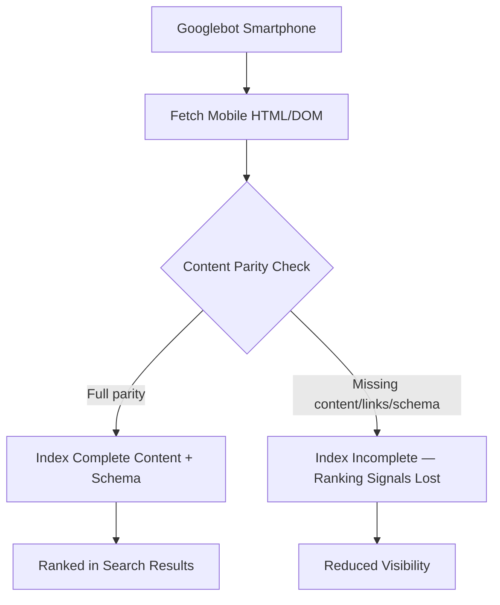

# Chapter 15: Mobile SEO & Mobile-First Indexing

**Version:** 1.0

---

# Table of Contents

1. Introduction
2. What is Mobile-First Indexing?
3. Timeline: How Google Got Here
4. Responsive Design vs. Dynamic Serving vs. Separate URLs
5. Viewport Configuration
6. Mobile Content Parity
7. Mobile Usability Issues
8. Touch Targets and Tap Elements
9. Mobile Page Speed
10. Interstitials and Pop-ups
11. Mobile Structured Data Parity
12. Testing Mobile-Friendliness
13. Diagram: Mobile-First Crawling Flow
14. Best Practices
15. Common Mistakes
16. Mobile SEO Checklist
17. Summary
18. References

---

# 1. Introduction

In 2019, Google completed its transition to **mobile-first indexing**: Googlebot now predominantly crawls, indexes, and ranks websites using the mobile version of their content, even for searches performed on desktop. A site that looks complete on desktop but strips content, links, or metadata on mobile is effectively invisible to Google's primary crawler.

This chapter covers what mobile-first indexing means in practice and the concrete checks required to avoid losing rankings due to mobile/desktop discrepancies.

---

# 2. What is Mobile-First Indexing?

Mobile-first indexing means Googlebot Smartphone is the default crawler used to render and evaluate a page's content, structured data, and metadata. Whatever is present in the mobile DOM is what gets indexed — content only present in a desktop-only version is not considered for ranking.

---

# 3. Timeline: How Google Got Here

| Year | Milestone |
|---|---|
| 2016 | Google announces mobile-first indexing experiments |
| 2018 | Gradual rollout begins for sites ready for mobile crawling |
| 2019 | Mobile-first indexing enabled by default for new websites |
| 2020 | March 2021 deadline announced for all remaining sites |
| 2023 | Mobile-first indexing effectively complete across the index |

---

# 4. Responsive Design vs. Dynamic Serving vs. Separate URLs

| Approach | Description | Google Recommendation |
|---|---|---|
| Responsive Design | Same HTML/URL, CSS adapts layout | **Recommended** |
| Dynamic Serving | Same URL, different HTML served based on user agent | Supported, higher maintenance (requires `Vary: User-Agent`) |
| Separate Mobile URLs (`m.example.com`) | Distinct mobile site with `rel=alternate`/`rel=canonical` pairing | Supported, highest maintenance and error-prone |

Responsive design is preferred because there is only one URL, one set of links, and one canonical version of the content to keep in sync — eliminating an entire class of mobile-first indexing bugs.

---

# 5. Viewport Configuration

Every page must declare a viewport meta tag so mobile browsers render at device width rather than a scaled-down desktop layout:

```html
<meta name="viewport" content="width=device-width, initial-scale=1">
```

Missing or misconfigured viewport tags are one of the most common causes of "Mobile Usability" errors in Search Console.

---

# 6. Mobile Content Parity

Under mobile-first indexing, anything hidden or removed on the mobile view — body text, internal links, structured data, hreflang tags, meta robots directives — is effectively invisible to Google. Content parity checks should confirm:

- Full body content renders on mobile, not a truncated summary
- All internal links present on desktop are present on mobile
- All structured data (JSON-LD) present on desktop is present on mobile
- `title`, meta description, and canonical tags match between versions

---

# 7. Mobile Usability Issues

Common issues reported in Search Console's Mobile Usability report:

- Text too small to read
- Clickable elements too close together
- Content wider than the screen
- Viewport not configured

---

# 8. Touch Targets and Tap Elements

Interactive elements (buttons, links, form fields) should have a minimum tap target size of approximately 48x48 CSS pixels with adequate spacing, per accessibility and mobile usability guidelines. Undersized or cramped tap targets increase mis-taps and directly hurt engagement metrics.

---

# 9. Mobile Page Speed

Mobile devices typically have slower CPUs and less reliable network conditions than desktop. Since Core Web Vitals ([Chapter 13](chapter-13.md)) are evaluated primarily on mobile field data, mobile performance optimization is not optional:

- Serve appropriately sized, compressed, next-gen format images (WebP/AVIF)
- Minimize and defer non-critical JavaScript
- Avoid render-blocking resources above the fold
- Use a CDN to reduce latency for mobile networks

---

# 10. Interstitials and Pop-ups

Google penalizes "intrusive interstitials" that block access to content immediately after arriving from a search result on mobile — full-screen pop-ups, app install banners covering content. Exemptions exist for legally required interstitials (cookie consent, age verification) and small banners that use a reasonable amount of screen space.

---

# 11. Mobile Structured Data Parity

Structured data ([Chapter 14](chapter-14.md)) must be present and identical in the mobile-rendered DOM. A common failure mode: schema is injected only by a desktop-specific script bundle that mobile templates don't load.

---

# 12. Testing Mobile-Friendliness

- **Search Console → Mobile Usability report** — sitewide issue detection
- **Chrome DevTools Device Mode** — manual per-page inspection
- **URL Inspection Tool** — compare the "mobile" rendered HTML directly against source
- **Lighthouse (Mobile)** — performance and accessibility audit under mobile conditions

---

# 13. Diagram: Mobile-First Crawling Flow



---

# 14. Best Practices

- Use responsive design as the default architecture
- Treat the mobile view as the canonical source of truth, not an afterthought
- Automate parity checks between desktop and mobile renders in CI
- Test with real mid-tier devices and throttled networks, not just DevTools emulation
- Keep hreflang, canonical, and meta robots tags identical across breakpoints

---

# 15. Common Mistakes

- Hiding content behind "read more" mobile-only truncation that removes it from the DOM entirely
- Loading structured data only via desktop-specific scripts
- Oversized tap targets or unreadable font sizes below 16px
- Blocking mobile-critical resources (CSS/JS) in `robots.txt`
- Shipping intrusive interstitials that trigger Google's mobile penalty

---

# 16. Mobile SEO Checklist

- [ ] Responsive design implemented sitewide
- [ ] Viewport meta tag present on every template
- [ ] Content, links, and schema verified identical between desktop and mobile DOM
- [ ] Tap targets meet minimum size and spacing guidelines
- [ ] No intrusive interstitials on mobile entry
- [ ] Mobile Core Web Vitals pass in field data (CrUX)
- [ ] Search Console Mobile Usability report shows zero errors

---

# Summary

Mobile-first indexing means the mobile version of a page is the version Google evaluates for ranking, regardless of where the search happens. Responsive design, strict content/schema parity, and mobile-specific performance and usability testing are non-negotiable requirements for modern SEO.

---

# Learning Outcomes

After completing this chapter, you will understand:

- What mobile-first indexing means for crawling and ranking
- How to architect for content and schema parity across devices
- How to identify and fix common mobile usability issues
- How to test and monitor mobile-friendliness continuously

---

# References

- Google Search Central: [Mobile-first Indexing Best Practices](https://developers.google.com/search/docs/crawling-indexing/mobile/mobile-sites-mobile-first-indexing)
- Chrome for Developers: [Introduction to Lighthouse](https://developer.chrome.com/docs/lighthouse/overview) — Google retired the Search Console Mobile Usability report on 1 December 2023 and points to Lighthouse instead
- web.dev: [Learn Responsive Design](https://web.dev/learn/design)

---

**Next:** Chapter 16 – International SEO & Hreflang
