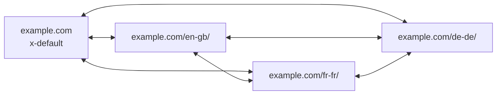

# Chapter 16: International SEO & Hreflang

**Version:** 1.0

---

# Table of Contents

1. Introduction
2. Language Targeting vs. Country Targeting
3. URL Structure Strategies
4. The hreflang Attribute
5. hreflang Implementation Methods
6. x-default
7. Return Tags and Reciprocity
8. Combining hreflang with Canonical Tags
9. Geotargeting in Search Console
10. Content Localization vs. Translation
11. International Site Architecture
12. CDNs and Regional Performance
13. Diagram: hreflang Cluster
14. Best Practices
15. Common Mistakes
16. International SEO Checklist
17. Summary
18. References

---

# 1. Introduction

International SEO ensures the correct language and regional version of a page is served to the correct audience in search results. Done well, a French-speaking user in Canada sees the `fr-CA` page; a French-speaking user in France sees `fr-FR`. Done poorly, search engines index duplicate or mismatched content, split ranking signals across versions, and serve the wrong page to the wrong market.

---

# 2. Language Targeting vs. Country Targeting

| Targeting Type | Example | Use Case |
|---|---|---|
| Language only | `en`, `fr`, `de` | Content differs only by language, not by region-specific offers |
| Language + Region | `en-US`, `en-GB`, `fr-CA`, `fr-FR` | Pricing, legal terms, spelling, or availability differ by country |
| Region only (rare) | `x-default` + region redirect | Single-language brand with country-specific storefronts |

---

# 3. URL Structure Strategies

| Structure | Example | Pros | Cons |
|---|---|---|---|
| ccTLD | `example.de` | Strongest geo-signal, user trust | Expensive, fragments domain authority |
| Subdomain | `de.example.com` | Easy to separate infrastructure | Slightly weaker authority consolidation than subfolder |
| Subfolder | `example.com/de/` | Consolidates domain authority | Requires careful server-side routing |
| URL Parameter | `example.com?lang=de` | Simplest to implement | **Not recommended** — weak signal, poor UX, hard to target |

Subfolders are the most common recommendation for sites without the budget or need for multiple ccTLDs.

---

# 4. The hreflang Attribute

`hreflang` tells search engines which language and (optionally) regional variant of a page to show for a given `lang-region` combination. It does not affect ranking directly — it affects which equivalent URL is shown to which searcher.

```html
<link rel="alternate" hreflang="en-us" href="https://example.com/us/" />
<link rel="alternate" hreflang="en-gb" href="https://example.com/uk/" />
<link rel="alternate" hreflang="fr-fr" href="https://example.com/fr/" />
<link rel="alternate" hreflang="x-default" href="https://example.com/" />
```

---

# 5. hreflang Implementation Methods

| Method | Location | Notes |
|---|---|---|
| HTML `<link>` tags | `<head>` of each page | Most common; must be present on every page in the cluster |
| HTTP headers | Response headers | Useful for non-HTML resources (PDFs) |
| XML Sitemap | `<xhtml:link>` entries | Preferred for large sites — avoids bloating every page's `<head>` |

---

# 6. x-default

`x-default` specifies the fallback page shown when no other hreflang entry matches the user's language/region — typically a language selector page or a global default (often English-US).

---

# 7. Return Tags and Reciprocity

Every page in an hreflang cluster must reference every other page in the cluster, **and** every referenced page must reference back. A one-directional hreflang link is ignored by Google. This reciprocity requirement is the single most common source of hreflang errors at scale — always generate hreflang clusters programmatically rather than by hand.

---

# 8. Combining hreflang with Canonical Tags

Each page's canonical tag should point to **itself**, not to the primary-language version. hreflang and canonical serve different purposes: canonical says "this is the authoritative URL for this content," while hreflang says "here are the equivalent URLs for other languages/regions." Pointing all canonicals at a single master page collapses the entire cluster into one indexed URL and breaks international targeting.

---

# 9. Geotargeting in Search Console

For subfolder and subdomain structures, Search Console's International Targeting settings (legacy) or ccTLD structure communicate the intended country audience for a section of a site, supplementing hreflang signals for country-specific ranking.

---

# 10. Content Localization vs. Translation

Translation converts words; localization adapts the entire experience — currency, date formats, units, legal disclosures, cultural references, local case studies, and region-specific calls to action. Machine-translated content with no localization frequently underperforms because it fails to match local search intent and phrasing patterns.

---

# 11. International Site Architecture

```text
example.com/            → x-default (global/EN)
example.com/en-gb/       → English, United Kingdom
example.com/fr-fr/       → French, France
example.com/fr-ca/       → French, Canada
example.com/de-de/       → German, Germany
```

Keep the folder structure flat and predictable; deeply nested locale paths complicate both hreflang maintenance and internal linking.

---

# 12. CDNs and Regional Performance

Core Web Vitals ([Chapter 13](chapter-13.md)) are measured per-region. A CDN with edge nodes near each target market keeps latency low regardless of where the origin server is hosted.

---

# 13. Diagram: hreflang Cluster



Every node links to every other node — full reciprocity across the cluster.

---

# 14. Best Practices

- Use subfolders unless there is a specific business case for ccTLDs
- Generate hreflang tags programmatically from a single source of truth (a locale map), never by hand
- Always include `x-default`
- Keep canonical tags self-referencing per locale
- Localize, don't just translate — adapt currency, units, and cultural context
- Validate hreflang reciprocity in CI before deployment

---

# 15. Common Mistakes

- Missing return tags (one-directional hreflang links)
- Pointing canonical tags at the primary-language version instead of self
- Using incorrect language/region codes (e.g., `uk` instead of `gb` for United Kingdom)
- Relying on machine translation with zero localization
- Mixing hreflang declarations between `<head>`, sitemap, and HTTP headers inconsistently
- Forgetting `x-default`, leaving no fallback for unmatched users

---

# 16. International SEO Checklist

- [ ] URL structure decided (subfolder/subdomain/ccTLD) and consistently applied
- [ ] hreflang implemented via one method only (head tags or sitemap, not both)
- [ ] Full reciprocity verified across the entire locale cluster
- [ ] `x-default` present
- [ ] Canonical tags are self-referencing per locale
- [ ] Content localized, not just machine-translated
- [ ] hreflang generation automated and validated in CI
- [ ] Regional performance verified via CDN and CrUX data per country

---

# Summary

International SEO hinges on correctly pairing content variants using hreflang, maintaining full reciprocity across the cluster, and keeping canonical tags self-referencing. Combined with genuine localization and region-aware performance, this ensures the right audience reaches the right version of a site without fragmenting ranking signals.

---

# Learning Outcomes

After completing this chapter, you will understand:

- How to choose a URL structure for multi-language/multi-region sites
- How hreflang works and how to implement it correctly at scale
- The difference between localization and translation
- How to audit and validate an hreflang cluster

---

# References

- Google Search Central: [Managing Multi-Regional and Multilingual Sites](https://developers.google.com/search/docs/specialty/international/managing-multi-regional-sites)
- Google Search Central: [Localized Versions of your Pages](https://developers.google.com/search/docs/specialty/international/localized-versions) — the hreflang reference
- ISO: [ISO 639 Language codes](https://www.iso.org/iso-639-language-codes.html) and [ISO 3166 Country codes](https://www.iso.org/iso-3166-country-codes.html)

---

**Next:** Chapter 17 – Site Architecture & URL Structure
