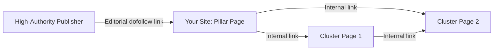

# Chapter 18: Off-Page SEO & Link Building

**Version:** 1.0

---

# Table of Contents

1. Introduction
2. What is Off-Page SEO?
3. Why Backlinks Still Matter
4. Link Equity and PageRank Fundamentals
5. Types of Links
6. Anchor Text
7. Link Quality Signals
8. White-Hat Link Building Tactics
9. Digital PR
10. Toxic Links and Disavow
11. Brand Mentions and Unlinked Citations
12. Off-Page Signals Beyond Links
13. Diagram: Link Equity Flow
14. Best Practices
15. Common Mistakes
16. Link Building Checklist
17. Summary
18. References

---

# 1. Introduction

Off-page SEO covers every ranking signal generated outside a site's own pages — primarily backlinks, but also brand mentions, citations, and third-party trust signals. Where on-page and technical SEO ([Chapters 3-14](chapter-03.md)) control how well a site can be crawled and understood, off-page SEO is largely how the rest of the web vouches for that site's authority and trustworthiness.

---

# 2. What is Off-Page SEO?

Off-page SEO is the practice of earning signals — links, mentions, citations, reviews — from other websites and platforms that indicate a site is authoritative, trustworthy, and worth ranking. It complements E-E-A-T ([Chapter 12](chapter-12.md)): strong content demonstrates expertise, while external validation demonstrates that others recognize it.

---

# 3. Why Backlinks Still Matter

Despite years of algorithm evolution, backlinks remain one of the strongest independent ranking correlations Google has confirmed using. A relevant, editorially-earned link acts as a third-party vote of confidence — a signal that is far harder to fake at scale than on-page content alone.

---

# 4. Link Equity and PageRank Fundamentals

Link equity ("link juice") is the value passed from a linking page to a linked page. It is influenced by:

- The linking page's own authority
- Topical relevance between the linking and target page
- The number of other outbound links on the linking page (equity is divided)
- Whether the link is `dofollow` or `nofollow`/`sponsored`/`ugc`

---

# 5. Types of Links

| Link Type | Attribute | Passes Equity? | Typical Source |
|---|---|---|---|
| Editorial (dofollow) | none | Yes | Earned coverage, citations |
| Nofollow | `rel="nofollow"` | No (hint, not guarantee) | Forums, comments, general caution |
| Sponsored | `rel="sponsored"` | No | Paid placements, affiliate links |
| UGC | `rel="ugc"` | No | User-generated content, comments |

---

# 6. Anchor Text

Anchor text is the clickable text of a link and provides a relevance signal to search engines. A healthy backlink profile has a natural, varied anchor text distribution — brand names, naked URLs, generic phrases ("click here", "read more"), and a modest share of keyword-relevant anchors. Anchor text dominated by exact-match commercial keywords is a strong manipulation signal.

---

# 7. Link Quality Signals

| Signal | Higher Quality | Lower Quality |
|---|---|---|
| Topical relevance | Same/adjacent industry | Unrelated niche |
| Domain authority/trust | Established, reputable domain | New, low-trust, or spam-flagged domain |
| Placement | Within editorial body content | Footer/sidebar link farms |
| Traffic | Real organic traffic | No real traffic, link-farm indicators |
| Link pattern | Naturally acquired over time | Sudden burst of identical/low-quality links |

---

# 8. White-Hat Link Building Tactics

- **Linkable assets** — original research, data studies, free tools, comprehensive guides that naturally attract citations
- **Digital PR** — newsworthy campaigns pitched to journalists and industry publications
- **Guest contribution** — genuinely valuable articles on relevant, reputable third-party sites
- **Resource page outreach** — pitching a linkable asset to existing curated resource/link pages
- **Broken link building** — identifying dead links on relevant sites and suggesting a working replacement
- **HARO/journalist requests** — providing expert commentary that earns citation-backed links
- **Unlinked brand mention reclamation** — see Section 11

---

# 9. Digital PR

Digital PR combines traditional PR tactics (newsworthy stories, data journalism, expert commentary) with a specific goal of earning high-authority editorial backlinks and brand mentions. Effective campaigns are typically built around: original data or surveys, timely commentary on trending topics, or creative/visual assets journalists can embed.

---

# 10. Toxic Links and Disavow

Toxic backlinks — from spam networks, link farms, or negative-SEO attacks — can suppress rankings if left unaddressed. Process:

1. Audit the backlink profile (Search Console, third-party tools) for spam signals
2. Attempt manual removal requests to webmasters first
3. Submit a disavow file via Search Console only for links that cannot be removed and are demonstrably harmful

Disavowing is a last resort — Google's algorithms already discount most low-quality links automatically, and over-aggressive disavowing can remove neutral links unnecessarily.

---

# 11. Brand Mentions and Unlinked Citations

Search engines increasingly interpret unlinked brand mentions as a trust and entity signal, feeding into Knowledge Graph associations ([Chapter 10](chapter-10.md)). Monitor for unlinked mentions and reach out to convert high-value ones into full citations/links where appropriate.

---

# 12. Off-Page Signals Beyond Links

- Reviews and ratings on third-party platforms (Google Business Profile, Trustpilot, industry directories)
- Social signals and share velocity (indirect — correlates with, does not directly cause, rankings)
- Citations in AI training data and retrieval corpora — increasingly relevant for AEO/GEO
- Business listing consistency (NAP) for local SEO ([local SEO chapters])

---

# 13. Diagram: Link Equity Flow

Equity earned externally flows into the site at the entry page and is then redistributed internally through the architecture described in [Chapter 17](chapter-17.md).

---

# 14. Best Practices

- Prioritize linkable assets and digital PR over manual outreach volume
- Diversify anchor text naturally — avoid exact-match keyword stuffing
- Vet link opportunities for topical relevance and real traffic, not just a domain metric score
- Monitor the backlink profile continuously for spam and negative-SEO patterns
- Treat unlinked brand mentions as a reclamation opportunity

---

# 15. Common Mistakes

- Buying links at scale from link networks or PBNs
- Over-optimizing anchor text with exact-match commercial keywords
- Chasing raw link volume instead of relevance and quality
- Disavowing links reflexively without evidence of harm
- Ignoring brand mention monitoring entirely

---

# 16. Link Building Checklist

- [ ] Backlink profile audited for toxic/spam links on a recurring cadence
- [ ] Anchor text distribution reviewed for natural variation
- [ ] At least one linkable asset in production or planned per quarter
- [ ] Digital PR or outreach pipeline active
- [ ] Unlinked brand mentions monitored and triaged
- [ ] Disavow file used only after manual removal attempts and clear evidence of harm

---

# Summary

Off-page SEO earns external validation of a site's authority and trustworthiness, primarily through backlinks but increasingly through brand mentions and third-party citations. Sustainable link building focuses on genuinely valuable content and relationships — digital PR, linkable assets, and targeted outreach — over manipulative, high-volume tactics that risk penalties.

---

# Learning Outcomes

After completing this chapter, you will understand:

- Why backlinks remain a core ranking signal
- How to evaluate link quality and anchor text health
- White-hat link building and digital PR tactics
- When and how to use the disavow tool responsibly

---

# References

- Google Search Central: [Spam Policies for Google Web Search](https://developers.google.com/search/docs/essentials/spam-policies)
- Google Search Central: [Qualify Outbound Links for SEO](https://developers.google.com/search/docs/crawling-indexing/qualify-outbound-links)

---

**Next:** Chapter 19 – Local SEO
