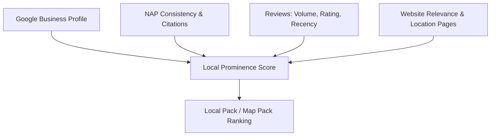

# Chapter 19: Local SEO

**Version:** 1.0

---

# Table of Contents

1. Introduction
2. Local Search Ranking Factors
3. Google Business Profile Optimization
4. NAP Consistency
5. Local Citations
6. Reviews and Reputation Signals
7. Location Pages
8. LocalBusiness Schema
9. The Local Pack and Map Pack
10. Service-Area Businesses vs. Storefronts
11. Multi-Location SEO
12. Local Link Building
13. Diagram: Local Ranking Signal Stack
14. Best Practices
15. Common Mistakes
16. Local SEO Checklist
17. Summary
18. References

---

# 1. Introduction

Local SEO optimizes a business's visibility for geographically constrained searches — "plumber near me," "dentist in Austin TX" — surfacing results in Google's Local Pack, Maps, and localized organic results. It combines conventional SEO signals with location-specific factors: proximity, Google Business Profile quality, citation consistency, and review reputation.

---

# 2. Local Search Ranking Factors

Google evaluates three primary factors for local results:

| Factor | Description |
|---|---|
| Relevance | How well a business profile and website match the search query |
| Distance | Proximity of each potential result to the searcher's location |
| Prominence | Overall authority — review volume/rating, backlinks, citation consistency, brand recognition |

---

# 3. Google Business Profile Optimization

Google Business Profile (GBP) is the single highest-leverage local SEO asset. Key optimization areas:

- Accurate, complete business category selection (primary + secondary)
- Full, consistent NAP (Name, Address, Phone)
- Business description with natural, non-keyword-stuffed language
- Photos and videos updated regularly
- Products/services listed with descriptions
- Q&A section monitored and answered
- Posts published regularly for engagement signals

---

# 4. NAP Consistency

NAP (Name, Address, Phone) consistency across GBP, the website, and third-party citations is a foundational trust signal. Even minor discrepancies (e.g., "St." vs. "Street," a disconnected old phone number) can confuse Google's entity matching and dilute prominence signals.

---

# 5. Local Citations

A citation is any online mention of a business's NAP data, with or without a link — data aggregators, industry directories, chambers of commerce, review platforms. Citation building and cleanup (correcting duplicate or outdated listings) directly supports NAP consistency and prominence.

---

# 6. Reviews and Reputation Signals

| Signal | Impact |
|---|---|
| Review volume | Higher volume correlates with higher local prominence |
| Review recency | Regular, recent reviews signal an active business |
| Average rating | Directly visible to searchers, affects click-through and trust |
| Owner responses | Demonstrates engagement; response rate is itself a ranking input |
| Review diversity | Reviews across multiple platforms (Google, Yelp, industry-specific) strengthen the trust signal |

Never use fake or incentivized reviews — Google actively detects and penalizes review manipulation, and it directly undermines the trustworthiness component of E-E-A-T ([Chapter 12](chapter-12.md)).

---

# 7. Location Pages

Multi-location businesses need a dedicated, unique page per location — not a single generic "locations" page or thin, templated duplicates. Each location page should include:

- Full NAP and embedded map
- Hours of operation, including holiday exceptions
- Location-specific content: staff, services offered at that location, local testimonials
- `LocalBusiness` schema scoped to that specific location
- Unique title/meta description referencing the specific city/region

---

# 8. LocalBusiness Schema

`LocalBusiness` structured data ([Chapter 14, Section 11](chapter-14.md)) formalizes NAP, hours, and geo-coordinates for search engines. For multi-location businesses, each location page should carry its own `LocalBusiness` instance, ideally nested under a parent `Organization` entity.

---

# 9. The Local Pack and Map Pack

The Local Pack is the map-plus-three-listings block shown for local-intent queries. Ranking in the Local Pack depends heavily on GBP completeness, review signals, and proximity — and is a largely separate ranking system from traditional organic blue-link results, meaning a business can rank well in one and not the other.

---

# 10. Service-Area Businesses vs. Storefronts

| Business Type | GBP Setup | Location Page Strategy |
|---|---|---|
| Storefront (retail, restaurant) | Physical address displayed publicly | One page per physical location |
| Service-area business (plumber, cleaner) | Address hidden, service area defined | Pages per service area/city served, without claiming a false physical presence |

Service-area businesses must avoid creating pages or listings that imply a physical office in cities where none exists — this violates Google's guidelines and risks suspension.

---

# 11. Multi-Location SEO

For businesses with many locations, scale location pages using a governed template (see `scripts/location_page_generator.py` in this repository) with mandatory quality gates: unique local content per page, verified NAP data, and no duplicate boilerplate beyond the shared template structure.

---

# 12. Local Link Building

Local link building emphasizes community and geographic relevance over raw authority: local news coverage, sponsorships, chamber of commerce and industry association memberships, and partnerships with complementary local businesses.

---

# 13. Diagram: Local Ranking Signal Stack

---

# 14. Best Practices

- Fully complete and regularly update Google Business Profile
- Maintain strict NAP consistency across all platforms
- Build unique, substantive location pages — never thin duplicates
- Actively and ethically encourage genuine customer reviews
- Respond to reviews, especially negative ones, promptly and professionally
- Use `LocalBusiness` schema scoped correctly per location

---

# 15. Common Mistakes

- Inconsistent NAP data across citations and the website
- Thin, templated location pages with no unique local content
- Fake, incentivized, or purchased reviews
- Service-area businesses falsely claiming a physical storefront
- Neglecting GBP after initial setup (stale photos, unanswered Q&A)
- Duplicate or unmerged GBP listings for the same location

---

# 16. Local SEO Checklist

- [ ] Google Business Profile fully optimized and verified
- [ ] NAP consistent across website, GBP, and top citation sources
- [ ] Unique, substantive location page per physical/service-area location
- [ ] `LocalBusiness` schema implemented per location
- [ ] Review generation process in place (ethical, non-incentivized)
- [ ] Review response process in place
- [ ] Local citation audit completed and duplicates merged
- [ ] Local link building/community engagement ongoing

---

# Summary

Local SEO layers geography-specific signals — Google Business Profile quality, NAP consistency, citations, and reviews — on top of standard SEO fundamentals to win visibility in the Local Pack and Maps. Multi-location and service-area businesses must scale this discipline through unique, well-governed location pages rather than thin duplication.

---

# Learning Outcomes

After completing this chapter, you will understand:

- The relevance/distance/prominence model Google uses for local ranking
- How to optimize Google Business Profile and maintain NAP consistency
- How to structure location pages for single and multi-location businesses
- How reviews and citations function as local trust signals

---

# References

- Google: [Google Business Profile Help](https://support.google.com/business)
- Google Business Profile Help: [Guidelines for representing your business on Google](https://support.google.com/business/answer/3038177)
- Google Business Profile Help: [Guidelines for representing your business on Google](https://support.google.com/business/answer/3038177)

---

**Next:** Chapter 20 – SEO Analytics & Measuring Success
