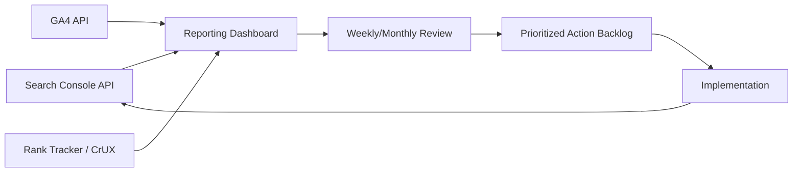

# Chapter 20: SEO Analytics & Measuring Success

**Version:** 1.0

---

# Table of Contents

1. Introduction
2. Setting SEO Goals and KPIs
3. Google Search Console
4. Google Analytics 4 for Organic Search
5. Rank Tracking
6. Core Web Vitals Monitoring
7. AI Search Visibility Tracking
8. Attribution and the Multi-Touch Problem
9. Building an SEO Reporting Dashboard
10. Cadence: Daily, Weekly, Monthly, Quarterly
11. Diagnosing Traffic Drops
12. Diagram: SEO Measurement Pipeline
13. Best Practices
14. Common Mistakes
15. SEO Reporting Checklist
16. Summary
17. Book Summary: Putting It All Together
18. References

---

# 1. Introduction

SEO work is only as good as the measurement behind it. Without reliable analytics, it is impossible to distinguish a successful optimization from noise, seasonality, or an algorithm update — and impossible to make the business case for continued investment. This closing chapter covers the tools, metrics, and reporting cadence needed to measure SEO performance rigorously, and ties together the full arc of the book.

---

# 2. Setting SEO Goals and KPIs

| Goal Type | Example KPI |
|---|---|
| Visibility | Organic impressions, average position, indexed pages |
| Traffic | Organic sessions/users, click-through rate |
| Engagement | Bounce rate, pages per session, time on page (directional only) |
| Business outcome | Organic conversions, leads, revenue, assisted conversions |
| Technical health | Core Web Vitals pass rate, crawl errors, indexation rate |

Anchor every SEO initiative to a business outcome KPI, not just a vanity visibility metric — rankings and traffic are means, not ends.

---

# 3. Google Search Console

Search Console is the most direct source of truth for how Google sees a site:

- **Performance report** — clicks, impressions, CTR, average position by query/page
- **Coverage/Indexing report** — indexed vs. excluded pages and reasons
- **Core Web Vitals report** — field data grouped by URL pattern
- **Mobile Usability report** — mobile-specific issues ([Chapter 15](chapter-15.md))
- **Enhancements** — structured data validity at scale ([Chapter 14](chapter-14.md))
- **Links report** — top linking sites and internal link distribution

---

# 4. Google Analytics 4 for Organic Search

GA4 complements Search Console by connecting organic sessions to on-site behavior and conversions. Segment the Organic Search channel to evaluate landing page performance, conversion rate by page/topic, and assisted conversions where organic contributes early in a multi-touch journey.

---

# 5. Rank Tracking

Rank tracking tools monitor keyword position over time, ideally segmented by device, location, and search feature (organic result vs. AI Overview vs. Local Pack). Position alone is an incomplete metric — pair it with CTR and conversion data, since position 3 with strong CTR can outperform position 1 with a poor snippet.

---

# 6. Core Web Vitals Monitoring

Monitor field data (CrUX, Search Console) as the source of truth for ranking impact, and lab data (Lighthouse, PageSpeed Insights) for pre-deployment regression testing — see [Chapter 13](chapter-13.md). Automate CWV checks in CI so performance regressions are caught before shipping, not after a ranking drop.

---

# 7. AI Search Visibility Tracking

Traditional rank tracking does not capture whether a page is cited in AI Overviews, ChatGPT search, or Perplexity answers. Emerging practice includes:

- Manually and programmatically sampling target queries across AI search surfaces
- Tracking brand/domain citation frequency and the specific passages quoted
- Monitoring referral traffic from AI platforms in GA4 (as a distinct channel/source)

This discipline is covered in depth in the AEO and GEO books in this series.

---

# 8. Attribution and the Multi-Touch Problem

Organic search is frequently a research-phase touchpoint rather than the final conversion driver. Data-driven or position-based attribution models in GA4 reduce (though do not eliminate) the risk of undervaluing organic's true contribution compared to last-click models.

---

# 9. Building an SEO Reporting Dashboard

A useful SEO dashboard consolidates:

- Organic sessions, clicks, and impressions trended over time
- Keyword position distribution and movement
- Core Web Vitals pass rate
- Indexation health (indexed vs. excluded page counts)
- Conversions/revenue attributed to organic
- AI search citation tracking (where available)

Automate data pulls via the Search Console and GA4 APIs rather than manual exports — see `scripts/seo_audit.py` in this repository for a starting point.

---

# 10. Cadence: Daily, Weekly, Monthly, Quarterly

| Cadence | Focus |
|---|---|
| Daily | Crawl errors, indexing anomalies, CWV alerting |
| Weekly | Ranking movement, new content performance |
| Monthly | Traffic/conversion trend review, technical audit summary |
| Quarterly | Strategic review against business KPIs, competitive gap analysis |

---

# 11. Diagnosing Traffic Drops

When organic traffic drops, work through causes systematically:

1. **Confirm it's real** — check for tracking/tagging errors first
2. **Segment** — is the drop sitewide, or isolated to a page/section/query cluster?
3. **Correlate with known algorithm updates** — check the timing against confirmed Google updates
4. **Check technical health** — new crawl errors, indexing drops, accidental `noindex`/`robots.txt` changes, broken canonicals
5. **Check for manual actions** — Security & Manual Actions report in Search Console
6. **Check competitive movement** — did a competitor's content/backlink profile improve rather than yours declining?

---

# 12. Diagram: SEO Measurement Pipeline

---

# 13. Best Practices

- Tie every SEO KPI to a business outcome, not just visibility
- Automate data collection to eliminate manual reporting errors
- Use field data (CrUX, Search Console) as the source of truth for real-world impact
- Investigate traffic anomalies methodically rather than jumping to conclusions
- Track AI search visibility alongside traditional rankings going forward

---

# 14. Common Mistakes

- Reporting only vanity metrics (rankings, traffic) with no business outcome tie-in
- Relying solely on lab data (Lighthouse) and ignoring field data for CWV
- Attributing a traffic drop to "the algorithm" without checking technical causes first
- Manual, error-prone spreadsheet reporting instead of automated dashboards
- Ignoring AI search citation tracking entirely

---

# 15. SEO Reporting Checklist

- [ ] SEO KPIs mapped to specific business outcomes
- [ ] Search Console and GA4 connected and segmented for organic
- [ ] Rank tracking in place, segmented by device/location
- [ ] Core Web Vitals monitored via field data with CI regression checks
- [ ] Reporting dashboard automated, not manually assembled
- [ ] Traffic drop diagnostic process documented and repeatable
- [ ] AI search visibility tracking in place or planned

---

# Summary

Rigorous measurement — grounded in Search Console, GA4, field performance data, and increasingly AI search visibility — turns SEO from a set of best-guess tactics into an accountable, iterative discipline. A automated dashboard and a systematic diagnostic process for traffic changes are what separate mature SEO programs from reactive ones.

---

# Book Summary: Putting It All Together

This book has moved from first principles to a complete, modern SEO practice:

- **Foundations** ([Ch. 1-6](chapter-01.md)): how search engines crawl, render, index, and rank content
- **Intent and Research** ([Ch. 7-8](chapter-07.md)): understanding what users actually want and finding the keywords that express it
- **On-Page Excellence** ([Ch. 9-12](chapter-09.md)): content optimization, entity SEO, internal linking, and E-E-A-T
- **Technical and Structural Foundations** ([Ch. 13-17](chapter-13.md)): Core Web Vitals, structured data, mobile-first indexing, international targeting, and site architecture
- **Authority and Measurement** ([Ch. 18-20](chapter-18.md)): off-page SEO, local SEO, and analytics

Each discipline compounds the others: architecture without content is empty, content without technical health is invisible, and none of it matters without measurement to prove and refine what works. The companion **AEO** and **GEO** books in this series extend these same principles into answer engines and AI-driven search — the next frontier this book has referenced throughout.

---

# Learning Outcomes

After completing this chapter, you will understand:

- How to define SEO KPIs tied to business outcomes
- The core analytics tools (Search Console, GA4) and how to use them together
- How to build an automated SEO reporting dashboard
- A systematic method for diagnosing organic traffic drops

---

# References

- Google Search Console Help Center
- Google Analytics 4 Documentation
- Google Search Central: Debugging Traffic Drops

---

**This concludes the SEO Book.** Continue to the **AEO Book** (`docs/books/complete/aeo/`) and **GEO Book** (`docs/books/complete/geo/`) to extend these principles into AI-powered search.
